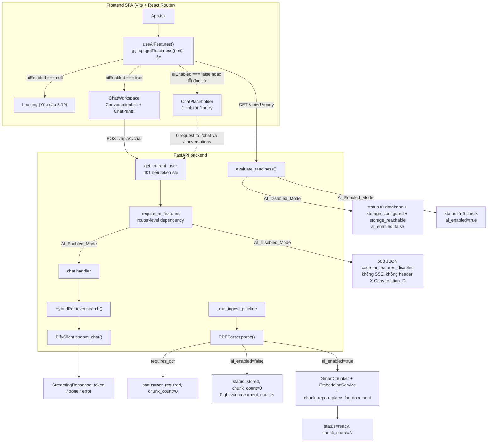
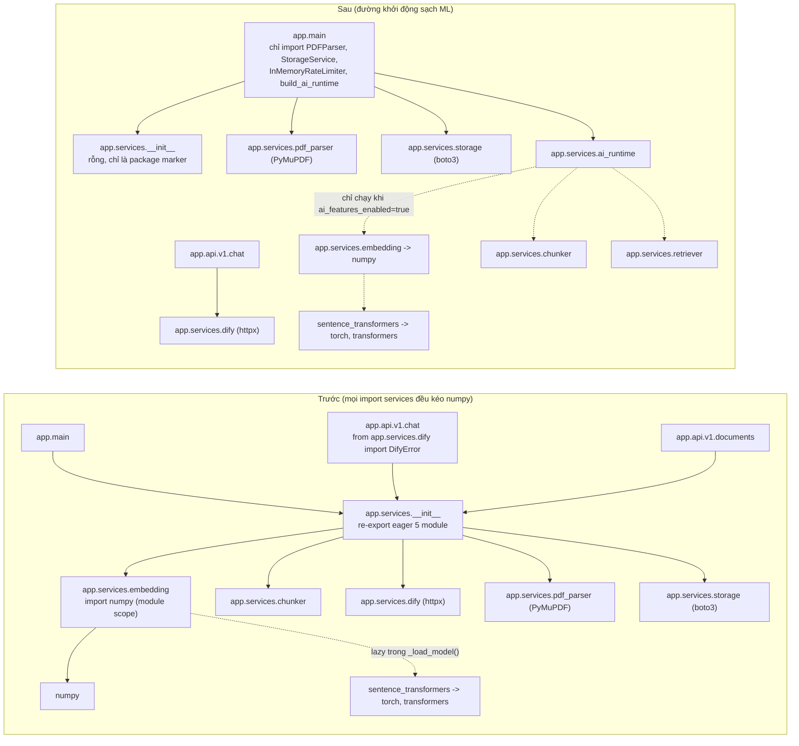

# Design Document

## Overview

Thiết kế này tắt toàn bộ đường dẫn AI của StudyRAG V2 bằng **một cờ cấu hình duy nhất** (`AI_FEATURES_ENABLED`, mặc định `false`) và gỡ `torch`/`sentence-transformers`/`transformers`/`numpy` khỏi tập dependency runtime, đồng thời giữ nguyên toàn bộ mã nguồn AI, schema database và dữ liệu đã lập chỉ mục để có thể bật lại chỉ bằng thay đổi cấu hình cộng một lệnh cài dependency.

Nguyên tắc kiến trúc của bản thiết kế:

1. **Cờ được phân giải một lần, lưu tại một chỗ.** `Settings.ai_features_enabled` là nguồn sự thật duy nhất; lifespan chiếu nó sang `app.state.ai_enabled` để mọi route, background task và probe đọc cùng một giá trị boolean mà không gọi lại `get_settings()`.
2. **Không import ML ở module scope trên đường dẫn khởi động.** Thay vì rải `try/except ImportError`, thiết kế cắt đúng hai chỗ tạo ra ràng buộc: xóa các re-export eager trong `backend/app/services/__init__.py` và chuyển việc import `EmbeddingService`/`HybridRetriever`/`SmartChunker`/`DifyClient` từ module scope của `main.py` vào một factory chỉ chạy ở `AI_Enabled_Mode`.
3. **Chặn ở tầng dependency, không ở thân handler.** Cổng `ai_features_disabled` là một FastAPI dependency ở mức router, đặt sau xác thực và trước khi FastAPI validate body, nên `Chat_Endpoint` không thể ghi `conversations`/`messages`, không gọi Dify và không truy vấn `document_chunks` ở `AI_Disabled_Mode`.
4. **Ingest thoái giảm chứ không dừng.** `Storage_Only_Ingest` là một early return ngay sau bước parse trong pipeline hiện có, nằm nguyên trong wrapper timeout đã tồn tại, kết thúc ở trạng thái mới `stored` với `chunk_count = 0`.
5. **Readiness tính theo chế độ.** `dify_configured` và `embedding_configured` vẫn được báo cáo nhưng chỉ tham gia phép tính `status` ở `AI_Enabled_Mode`; `ai_enabled` được thêm vào `ReadyResponse` (không thêm vào `DependencyStatus`, xem mục hazard bên dưới) và là kênh duy nhất frontend dùng để biết trạng thái cờ.
6. **Frontend fail-safe.** Khi không đọc được `ai_enabled`, SPA coi như `false` và hiển thị `Chat_Placeholder`; nhánh bị tắt được tách ở biên component nên các hook gọi API (`useConversations`, `useDocuments`) không được mount, đảm bảo 0 request.

Phạm vi thay đổi: 3 file cấu hình/packaging (`requirements.txt`, `requirements-ai.txt` mới, `Dockerfile`), 7 file backend, 1 migration nhân bản 2 bản, 8 file frontend, 1 script verify, và 6 file test mới cộng phần mở rộng `conftest.py`. Không xóa file nào của tầng AI.

## Nghiên cứu và phát hiện

Khảo sát mã nguồn cho thấy ba điểm mà `requirements.md` (đã được duyệt) giả định khác với thực tế. Thiết kế xử lý cả ba một cách tường minh thay vì viết code cho một thực tế không tồn tại.

### 1. `torch` và `transformers` vốn đã không được import lúc startup — cản trở thật là `numpy` và cascade trong `app/services/__init__.py`

Sự thật đã xác minh:

- `torch` và `transformers` **không được import trực tiếp ở bất kỳ đâu** trong backend; chúng đến gián tiếp qua `sentence_transformers`.
- `backend/app/services/embedding.py`: `from sentence_transformers import SentenceTransformer` nằm ở L26, **bên trong `_load_model()`** dưới `threading.Lock` — đã lazy. Import nặng duy nhất ở module scope là `import numpy as np` (L5).
- `backend/app/services/chunker.py`: `from transformers import AutoTokenizer` ở L39 nằm trong `_get_tokenizer()`, bọc `try/except Exception` và set `self._tokenizer = False`. Module **đã** thoái giảm êm khi thiếu `transformers`: `token_count()` rơi về đếm từ theo khoảng trắng, `_word_token_counts()` rơi về `[1] * len(words)`. Biên chunk dịch chuyển nhưng không có exception.
- `backend/app/services/retriever.py` không dùng numpy, RRF thuần Python; ràng buộc ML duy nhất là `from app.services.embedding import EmbeddingService` (L9). `backend/app/services/dify.py` chỉ dùng `httpx`.
- Cản trở thật nằm ở `backend/app/services/__init__.py` L1–5, re-export eager `SmartChunker`, `DifyClient`, `EmbeddingService`, `PDFParser`, `StorageService`. Vì vậy **bất kỳ** `from app.services.X import Y` cũng chạy `__init__` và do đó import `embedding` → `numpy`. `backend/app/api/v1/chat.py` L16 (`from app.services.dify import DifyError`) kích hoạt đúng cascade này.

**Hệ quả:** Yêu cầu 6 tiêu chí 7 (không có `torch`/`sentence_transformers`/`transformers` trong tập module đã import khi startup kết thúc) **đã đúng ngay hôm nay**. Phần công việc kỹ thuật thật gồm ba việc: (a) gỡ package khỏi image, (b) quyết định số phận của `numpy`, (c) cắt cascade `app/services/__init__.py`.

**Quyết định về `numpy`:** đưa `numpy` sang tập dependency AI tùy chọn và **giữ `import numpy as np` ở module scope của `embedding.py`**. Lý do: sau khi cắt cascade, không đường dẫn nào ở `AI_Disabled_Mode` import `app.services.embedding`, nên module không importable là chấp nhận được và còn có lợi — nó biến bất biến "không ML trong `sys.modules`" thành một assertion kiểm chứng được (`numpy` cũng nằm trong danh sách cấm), và khớp Yêu cầu 6 tiêu chí 8 vốn muốn một lỗi import nêu tên tập dependency tùy chọn. Đánh đổi: `app.services.embedding` và `app.services.retriever` không import được ở `AI_Disabled_Mode`, nên test chạm hai module này phải dùng skip có điều kiện (đã là nghĩa vụ theo Yêu cầu 8 tiêu chí 5–6) và `build_ai_runtime()` phải bọc `ImportError` thành thông điệp tiếng Việt nêu tên `backend/requirements-ai.txt`.

Phương án bị loại: chuyển `import numpy` vào trong `_encode_sync()` và giữ `numpy==2.5.1` trong runtime. Nó tiết kiệm được việc sửa test nhưng giữ lại ~15–20 MB, giữ một ràng buộc nâng version không cần thiết trong tập runtime, và biến lỗi thiếu dependency từ "ImportError lúc bật cờ" thành "lỗi lúc encode request đầu tiên" — trễ hơn và khó chẩn đoán hơn.

**Tu chỉnh `requirements.md` đã được áp dụng.** Định nghĩa `ML_Dependencies` trong Glossary nay ghi `numpy` là thành viên **vô điều kiện** bên cạnh `torch`, `sentence-transformers`, `transformers`, và Yêu cầu 6 tiêu chí 1, 3, 7, 10, 12 đã được cập nhật để đưa `numpy` vào danh sách package tương ứng. Thiết kế và requirements do đó khớp nhau: `numpy` bị gỡ khỏi tập runtime, nằm trong tập dependency AI tùy chọn, bị cấm trong `Runtime_Image` và vắng khỏi `sys.modules` khi startup kết thúc. Ghi chú kỹ thuật giữ nguyên: tiêu chí 6.7 được thỏa nhờ hai bước (cắt cascade + gỡ package), không phải nhờ việc di chuyển import ML.

### 2. Timeout cho ingest đã tồn tại

`backend/app/api/v1/documents.py` L133–197: `_process_document(...)` đã bọc `_run_ingest_pipeline(...)` trong `asyncio.wait_for(..., timeout=float(getattr(settings, "ingest_timeout_seconds", 900) or 900))`, với ba nhánh xử lý — `TimeoutError` → `failed` kèm `f"Xử lý tài liệu vượt quá {int(timeout)} giây và đã bị hủy."`, `Exception` → `failed` kèm `str(exc)[:1000]`, và `BaseException` → `asyncio.shield(_set_status(failed))` rồi re-raise.

**Hệ quả:** Yêu cầu 3 tiêu chí 12 **đã được code hiện tại thỏa mãn**. Thiết kế không thêm cơ chế timeout mới. Nghĩa vụ duy nhất: nhánh `Storage_Only_Ingest` phải nằm **bên trong** `_run_ingest_pipeline` (tức bên trong `wait_for`), không được thành một task riêng ở `ingest_document`. Cần một test hồi quy khẳng định điều này. Không cần sửa `requirements.md`; tiêu chí vẫn hợp lệ, chỉ là đã xanh trước khi bắt đầu.

### 3. Giá trị cờ không hợp lệ làm sập ở thời điểm import, không phải trong lifespan

`backend/app/main.py` L24 gọi `get_settings()` ở **module scope** (để cấu hình `logging.basicConfig`), và gọi lần nữa lúc dựng app cho `CORSMiddleware.allow_origins`. `get_settings()` được `@lru_cache`, nên `Settings()` được khởi tạo — và validate — ngay khi `app.main` được import, **trước** khi lifespan chạy.

**Hệ quả:** Yêu cầu 1 tiêu chí 3 (bản trước tu chỉnh) viết "THE FastAPI_Application SHALL dừng lifespan startup với lỗi cấu hình". Với kiến trúc hiện tại, `ValidationError` nổ lúc import module, tiến trình uvicorn thoát với exit code khác 0 và **lifespan không bao giờ bắt đầu**. Đây là hành vi *mạnh hơn* điều tiêu chí yêu cầu (fail sớm hơn, không có cửa sổ nào server nhận request với cấu hình sai), nhưng đúng theo nghĩa chữ thì không khớp.

**Giải pháp được chọn:** giữ fail-fast ở thời điểm import; không thêm cơ chế trì hoãn validate tới lifespan (làm vậy sẽ phải bỏ `@lru_cache` hoặc dựng Settings hai lần, tệ hơn). Bù lại, `@field_validator(mode="before")` chịu trách nhiệm sinh thông điệp tiếng Việt nêu rõ tên biến `AI_FEATURES_ENABLED` và tập giá trị hợp lệ, để log lúc thoát vẫn đủ thông tin chẩn đoán. **Tu chỉnh đã được áp dụng vào Yêu cầu 1 tiêu chí 3:** tiêu chí nay yêu cầu "dừng khởi động tiến trình tại thời điểm cấu hình được phân giải lần đầu, ở bước import module cấu hình hoặc ở bước lifespan startup tùy nơi nào đến trước", kèm lỗi nêu rõ tên biến và tập giá trị hợp lệ và không âm thầm rơi về giá trị mặc định. Đây là thay đổi từ ngữ, không thay đổi hành vi kiểm chứng được.

**Phát hiện kèm theo về parse bool:** pydantic v2 **đã** chấp nhận `true/false/1/0/yes/no/on/off` không phân biệt hoa thường, nên tiêu chí 1.1 gần như miễn phí. Nhưng pydantic **không** thỏa tiêu chí 1.2: chuỗi rỗng hoặc chỉ có khoảng trắng (`AI_FEATURES_ENABLED=""`, một trường hợp rất hay gặp trong `.env` và Docker `-e`) làm pydantic raise `ValidationError` thay vì trả `false`. Đó là lý do chính thực sự cần `@field_validator(mode="before")`, không phải để parse các giá trị hợp lệ.

### Hazard được phát hiện thêm (không thuộc ba mục trên nhưng bắt buộc phải xử lý)

- **`backend/app/api/v1/system.py` L29** dùng `all_ready = all(checks.model_dump().values())` — phép AND trên **mọi** field của `DependencyStatus`. Nếu thêm `ai_enabled` vào `DependencyStatus`, `AI_Disabled_Mode` sẽ tự động báo `not_ready`, phá thẳng Yêu cầu 4 tiêu chí 1. Vì vậy `ai_enabled` **phải** nằm trên `ReadyResponse`, và `all(...)` phải bị thay bằng phép chọn field tường minh.
- **`backend/app/db/repositories/document_repo.py` `stats()`** seed dict với 5 khóa cố định rồi gán `result[key] = count` từ `GROUP BY status`. Một giá trị `stored` chưa được seed sẽ **raise `KeyError`** → 500 ở `GET /api/v1/documents/stats`. Đây là crash tiềm ẩn phải sửa cùng migration, không phải sau.
- **`backend/app/main.py` có bộ probe trùng lặp**: `/health` L92–94 trả literal JSON (không dùng schema) và `/ready` L97–104 tự tính `configured = storage.configured and dify.configured and embedding.configured` rồi `ready = database and configured and storage_reachable`. Yêu cầu 4 tiêu chí 3 buộc `ai_enabled` xuất hiện ở **cả hai** route `/ready`, nên cả hai đều phải sửa; bản thân sự trùng lặp là rủi ro trôi lệch và được xử lý bằng cách rút logic ra một hàm dùng chung.
- **`request.app.state.dify.configured` và `.embedding.configured`** được đọc trực tiếp ở cả hai `/ready`. Ở `AI_Disabled_Mode` hai attribute này là `None`, nên phải bọc `getattr(..., "configured", False)` (Yêu cầu 4 tiêu chí 9).

## Architecture

### Luồng request ở hai chế độ



### Đồ thị import: trước và sau



Đường nét liền là import bắt buộc lúc khởi động; đường nét đứt là import bị trì hoãn tới khi cờ bật. Sau thay đổi, tập module bắt buộc lúc khởi động không chứa `numpy`, `torch`, `transformers`, `sentence_transformers` — bất biến này được khóa bằng test (xem `test_no_ml_imports.py`).

## Components and Interfaces

### 1. Cờ cấu hình — `backend/app/core/config.py`

Thêm đúng một field và một validator. Đây là field `bool` đầu tiên và `@field_validator` đầu tiên của file, nên đặt ngay sau `log_level` để không phá thứ tự nhóm hiện có.

```python
from pydantic import Field, field_validator

_TRUE_VALUES = frozenset({"true", "1", "yes", "on"})
_FALSE_VALUES = frozenset({"false", "0", "no", "off"})


class Settings(BaseSettings):
    ...
    log_level: str = Field(default="INFO", validation_alias="LOG_LEVEL")
    ai_features_enabled: bool = Field(default=False, validation_alias="AI_FEATURES_ENABLED")

    @field_validator("ai_features_enabled", mode="before")
    @classmethod
    def _parse_ai_flag(cls, value: object) -> bool:
        """Parse AI_FEATURES_ENABLED thành total function trên miền chuỗi.

        Chuỗi rỗng hoặc chỉ khoảng trắng -> False (Yêu cầu 1 tiêu chí 2), vì pydantic
        mặc định coi đây là lỗi. Giá trị ngoài tập hợp lệ -> ValueError với thông điệp
        nêu tên biến và tập giá trị hợp lệ (Yêu cầu 1 tiêu chí 3).
        """
        if isinstance(value, bool):
            return value
        if value is None:
            return False
        text = str(value).strip().lower()
        if not text:
            return False
        if text in _TRUE_VALUES:
            return True
        if text in _FALSE_VALUES:
            return False
        raise ValueError(
            "AI_FEATURES_ENABLED không hợp lệ. Giá trị hợp lệ: "
            "true, 1, yes, on (bật) hoặc false, 0, no, off (tắt)."
        )
```

Tính chất: hàm là **total** trên `str | bool | None` — mọi input hoặc trả về `bool`, hoặc raise `ValueError` với thông điệp cố định; không có nhánh nào âm thầm dùng default.

`model_cache_dir()` được giữ nguyên (Yêu cầu 1 tiêu chí 8: `embedding.py` phải import được khi dependency có mặt), dù ở `AI_Disabled_Mode` không còn ai gọi.

`backend/.env.example` thêm (Yêu cầu 1 tiêu chí 9):

```dotenv
# Bật/tắt toàn bộ tính năng AI (embedding, hybrid retrieval, chat qua Dify).
# Giá trị hợp lệ: true, 1, yes, on | false, 0, no, off. Mặc định: false.
# Đặt true yêu cầu cài thêm tập dependency AI tùy chọn:
#   pip install -r backend/requirements-ai.txt
AI_FEATURES_ENABLED=false
```

### 2. Factory dịch vụ AI — `backend/app/services/ai_runtime.py` (mới)

Module này là biên duy nhất nơi mã nguồn import tầng AI. Nó tồn tại để `main.py` không cần bất kỳ import ML ở module scope, và để lỗi thiếu dependency có thông điệp nêu tên tập tùy chọn (Yêu cầu 1 tiêu chí 6, Yêu cầu 6 tiêu chí 8).

```python
from __future__ import annotations

from dataclasses import dataclass
from typing import TYPE_CHECKING, Any

from app.core.config import Settings

if TYPE_CHECKING:  # chỉ để type check, không import lúc runtime
    from app.services.chunker import SmartChunker
    from app.services.dify import DifyClient
    from app.services.embedding import EmbeddingService

AI_EXTRA_HINT = "pip install -r backend/requirements-ai.txt"


class AIDependencyError(RuntimeError):
    """Thiếu dependency AI tùy chọn trong khi AI_FEATURES_ENABLED=true."""


@dataclass(frozen=True, slots=True)
class AIRuntime:
    dify: "DifyClient"
    embedding: "EmbeddingService"
    chunker: "SmartChunker"


def build_ai_runtime(settings: Settings) -> AIRuntime:
    """Khởi tạo tầng AI. Raise AIDependencyError nếu ML_Dependencies chưa được cài."""
    try:
        from app.services.chunker import SmartChunker
        from app.services.dify import DifyClient
        from app.services.embedding import EmbeddingService
    except ImportError as exc:
        raise AIDependencyError(
            f"AI_FEATURES_ENABLED=true nhưng thiếu dependency AI tùy chọn ({exc.name}). "
            f"Cài bằng: {AI_EXTRA_HINT}"
        ) from exc
    return AIRuntime(
        dify=DifyClient(settings),
        embedding=EmbeddingService(settings),
        chunker=SmartChunker(),
    )


def build_retriever(pool: Any, embedding: Any, settings: Settings) -> Any:
    """Tách riêng vì HybridRetriever cần pool, chỉ dựng được sau khi pool sẵn sàng."""
    try:
        from app.db.repositories.chunk_repo import ChunkRepository
        from app.services.retriever import HybridRetriever
    except ImportError as exc:
        raise AIDependencyError(
            f"Không dựng được HybridRetriever vì thiếu dependency AI tùy chọn ({exc.name}). "
            f"Cài bằng: {AI_EXTRA_HINT}"
        ) from exc
    return HybridRetriever(ChunkRepository(pool), embedding, settings)
```

`AIDependencyError` **không** bị bắt trong lifespan — nó lan lên và làm startup thất bại (Yêu cầu 1 tiêu chí 6: không tự động rơi về `AI_Disabled_Mode`).

### 3. Cắt cascade — `backend/app/services/__init__.py`

Toàn bộ nội dung file được thay bằng package marker. Đã xác minh không có chỗ nào trong repo dùng `from app.services import X` (chỉ có `from app.services.<module> import X`), nên thay đổi này không phá call site nào.

```python
"""Package dịch vụ.

Không re-export eager: `from app.services.dify import DifyClient` trước đây chạy
__init__ và do đó import cả `embedding` -> numpy, kéo toàn bộ tầng ML vào đường
khởi động. Mọi call site phải import trực tiếp từ module con.
"""

__all__: list[str] = []
```

### 4. Wiring lifespan — `backend/app/main.py`

Bỏ L16–21 (`SmartChunker`, `DifyClient`, `EmbeddingService`, `HybridRetriever`) khỏi module scope; giữ `PDFParser`, `InMemoryRateLimiter`, `StorageService`. Thêm `from app.services.ai_runtime import build_ai_runtime, build_retriever`.

```python
@asynccontextmanager
async def lifespan(app: FastAPI):
    settings = get_settings()
    app.state.settings = settings
    app.state.ai_enabled = settings.ai_features_enabled
    app.state.storage = StorageService(settings)
    app.state.pdf_parser = PDFParser()
    app.state.rate_limiter = InMemoryRateLimiter(settings.chat_rate_limit_per_minute)
    app.state.dify = None
    app.state.embedding = None
    app.state.chunker = None
    app.state.retriever = None
    if settings.ai_features_enabled:
        # AIDependencyError cố tình không bị bắt: startup phải thất bại.
        ai = build_ai_runtime(settings)
        app.state.dify, app.state.embedding, app.state.chunker = ai.dify, ai.embedding, ai.chunker
    app.state.pool = None
    try:
        app.state.pool = await create_pool(settings)
        if settings.ai_features_enabled:
            app.state.retriever = build_retriever(app.state.pool, app.state.embedding, settings)
        logger.info("Database pool initialized")
    except Exception:
        app.state.retriever = None
        logger.exception("Database initialization failed; API will report not_ready")
    if app.state.pool is not None:
        ...  # job fail_stale_processing giữ nguyên
    logger.info("AI features enabled: %s", settings.ai_features_enabled)  # Yêu cầu 4 tiêu chí 6
    try:
        yield
    finally:
        await close_pool(app.state.pool)
```

Ghi chú thiết kế:

- `app.state.ai_enabled: bool` là nguồn đọc duy nhất cho route và background task. Không route nào gọi lại `settings.ai_features_enabled`, để test có thể đảo chế độ bằng một attribute.
- Các attribute AI được set `None` một cách tường minh (không xóa) nên `getattr(state, "dify", None)` không phải là cái cớ che lỗi chính tả mà là guard cho một giá trị thật sự có thể `None`.
- Dòng log `AI features enabled: %s` đặt sau mọi bước startup và trước `yield`: đúng một entry INFO cho mỗi lần khởi động tiến trình. Không log giá trị secret nào (Yêu cầu 4 tiêu chí 7).
- `fail_stale_processing(older_than_seconds=settings.ingest_timeout_seconds)` giữ nguyên; nó chỉ chạm `status='processing'` nên trạng thái `stored` không bị nó ảnh hưởng.

### 5. Cổng chat — `backend/app/api/deps.py` và `backend/app/api/v1/chat.py`

`deps.py` là chỗ đặt tự nhiên (đã chứa `SettingsDep`, `CurrentUser`, `PoolDep` và không import `services/`).

```python
from app.core.exceptions import AppError

AI_DISABLED_MESSAGE = (
    "Tính năng hỏi đáp AI đang tạm ngưng để nâng cấp hệ thống. "
    "Bạn vẫn dùng được thư viện tài liệu và có thể thử lại sau."
)  # 118 ký tự, trong khoảng 20-200 của Yêu cầu 2 tiêu chí 2


def require_ai_features(request: Request, current_user: CurrentUser) -> None:
    """Chặn request khi AI_Disabled_Mode.

    Phụ thuộc CurrentUser để 401 luôn thắng 503 (Yêu cầu 2 tiêu chí 6). FastAPI cache
    dependency theo callable trong cùng request nên get_current_user chỉ chạy một lần.
    """
    if not bool(getattr(request.app.state, "ai_enabled", False)):
        raise AppError(503, AI_DISABLED_MESSAGE, code="ai_features_disabled")


AIFeaturesGate = Annotated[None, Depends(require_ai_features)]
```

Gắn ở mức router trong `chat.py`:

```python
router = APIRouter(
    prefix="/chat",
    tags=["chat"],
    dependencies=[Depends(require_ai_features)],
)
```

Thân hàm `chat(...)` **không đổi một dòng nào** — không thêm `if` nào vào handler. Đây là điểm mấu chốt để thỏa Yêu cầu 2 tiêu chí 3/4/5: vì handler không chạy, không có `conversation_repo.create()`, không có `add_message()`, không có `retriever.search()`, không có `dify.stream_chat()`.

**Vì sao chọn dependency thay vì kiểm tra trong handler (Yêu cầu 2 tiêu chí 8).** Yêu cầu 2 tiêu chí 8 buộc body không hợp lệ vẫn trả 503 chứ không phải 422. Handler hiện tại có tham số `payload: ChatRequest`, nên một `if` trong thân hàm không thể thỏa: FastAPI validate body trước khi thân hàm chạy. Ba phương án được cân nhắc:

| Phương án | Cơ chế | Kết quả |
| --- | --- | --- |
| (a) **Dependency mức router** (chọn) | Trong `solve_dependencies`, FastAPI giải toàn bộ dependency **trước** khi validate các field của body; exception từ dependency lan ra ngay. Dependency mức router được đặt trước tham số của route trong danh sách dependant. | 401 (từ `CurrentUser` bên trong cổng) thắng 503; 503 thắng 422 của schema body. Giữ nguyên OpenAPI schema và hành vi validate ở `AI_Enabled_Mode`. |
| (b) Đổi tham số body thành `Request` và tự parse | Handler nhận `Request`, tự `await request.json()` rồi `ChatRequest.model_validate(...)`. | Thỏa cả trường hợp JSON hỏng, nhưng mất schema `ChatRequest` trong OpenAPI, mất `RequestValidationError` chuẩn, và làm bẩn đường dẫn `AI_Enabled_Mode` vốn đang đúng. Loại. |
| (c) Middleware theo path `/api/v1/chat` | Middleware chạy trước toàn bộ dependency. | **Phá Yêu cầu 2 tiêu chí 6**: request không có token cũng nhận 503 thay vì 401, vì middleware chạy trước xác thực. Muốn cứu thì phải nhân bản logic verify JWT trong middleware. Loại. |

**Sai lệch được thừa nhận của phương án (a).** FastAPI đọc và `json.loads` body **trước** khi gọi `solve_dependencies`; nếu byte body không phải JSON hợp lệ (ví dụ `{"query":`), `RequestValidationError` được raise ngay tại bước decode và trả **422**, không phải 503. Nghĩa là tiêu chí 8 đúng với "body hợp lệ về cú pháp nhưng sai schema" (thiếu `query`, `document_id` sai kiểu, `document_id` không tồn tại, `conversation_id` của người khác) và **không** đúng với "byte body không parse được thành JSON". Tu chỉnh đã được áp dụng: tiêu chí 8 nay giới hạn phạm vi ở body "hợp lệ về cú pháp JSON nhưng không thỏa schema `ChatRequest`", và tiêu chí 9 mới cho phép tường minh 422 cho body không parse được thành JSON, ghi rõ kết quả đó không được coi là vi phạm cổng kiểm tra cờ. Nhờ vậy phương án (a) thỏa cả tiêu chí 8 và tiêu chí 6, không cần cách vá tạm.

**Quyết định về `Conversation_Endpoints`:** **không** gắn cổng. Yêu cầu 7 (bảo toàn dữ liệu) và Yêu cầu 5 tiêu chí 3 chỉ buộc *frontend* không gọi các endpoint này ở chế độ tắt; API vẫn cho người dùng đọc và xóa hội thoại của chính mình, giữ nguyên khả năng truy cập lịch sử và quyền xóa cascade mà Yêu cầu 7 tiêu chí 10 cho phép.

`chat.py` L16 `from app.services.dify import DifyError` được giữ: sau khi cắt cascade nó chỉ kéo `httpx`, nên module `chat.py` vẫn import được ở `AI_Disabled_Mode` và test SSE vẫn thu thập được.

### 6. `Storage_Only_Ingest` — `backend/app/api/v1/documents.py`

Chỉ chèn một nhánh early return vào `_run_ingest_pipeline`, ngay sau `parser.parse(content)` và **sau** kiểm tra `requires_ocr` (vì Yêu cầu 3 tiêu chí 4 buộc `ocr_required` thắng `stored`).

```python
async def _run_ingest_pipeline(
    *, request: Request, owner_id: UUID, document_id: UUID, content: bytes, doc_type: str
) -> None:
    pool = request.app.state.pool
    document_repo = DocumentRepository(pool)
    parser = request.app.state.pdf_parser

    parsed = parser.parse(content)
    if parsed.requires_ocr:
        await _set_status(
            document_repo, owner_id, document_id,
            status="ocr_required",
            page_count=parsed.page_count,
            chunk_count=0,
            error_message="PDF không có lớp text; cần OCR trước khi lập chỉ mục.",
        )
        return

    if not bool(getattr(request.app.state, "ai_enabled", False)):
        # Storage_Only_Ingest: dừng ngay sau parse. Không chunker, không embedding,
        # không thao tác nào trên document_chunks.
        await _set_status(
            document_repo, owner_id, document_id,
            status="stored",
            page_count=parsed.page_count,
            chunk_count=0,
            error_message=None,
        )
        return

    chunk_repo = ChunkRepository(pool)
    chunker = request.app.state.chunker
    embedding = request.app.state.embedding
    ...  # phần còn lại giữ nguyên: build -> encode -> replace_for_document -> ready
```

Ghi chú thiết kế:

- `ChunkRepository(pool)`, `request.app.state.chunker`, `request.app.state.embedding` được dời **xuống sau** nhánh tắt. Ở `AI_Disabled_Mode` hai attribute sau là `None`; không đọc chúng sớm giúp tránh phụ thuộc vô nghĩa và làm rõ rằng nhánh tắt không chạm tầng AI.
- Nhánh mới nằm trong `_run_ingest_pipeline`, tức bên trong `asyncio.wait_for` của `_process_document`, nên Yêu cầu 3 tiêu chí 12 tiếp tục được thỏa **không cần code mới**. Nếu một lần refactor sau này đưa nhánh này ra `ingest_document`, bảo đảm timeout mất hiệu lực — có test hồi quy cho điều này.
- `_set_status` nay truyền `chunk_count=0` tường minh ở cả nhánh `ocr_required` và `stored` để `chunk_count` không phụ thuộc giá trị mặc định của row (Yêu cầu 3 tiêu chí 4/5 đều đòi 0).
- `ingest_document` (L199–253) **không đổi**: kiểm tra content type, kích thước, magic `%PDF-`, dedupe `(owner_id, file_hash)`, upload S3 với rollback, tạo row `processing`, `background_tasks.add_task(_process_document, ...)`, trả 202. Yêu cầu 3 tiêu chí 1 và 11 đã đúng.
- `parser.parse(content)` vẫn là lời gọi đồng bộ không offload. Đó là công việc của `IRP-001`/`IRP-002`, ngoài phạm vi spec này; ghi lại ở mục Risks.
- Whitelist filter status tại L267–268 mở rộng thành `{"processing", "stored", "ready", "failed", "ocr_required"}` (Yêu cầu 3 tiêu chí 13). Truy vấn list vẫn đi qua `DocumentRepository.list(...)` với điều kiện `owner_id`, nên tiêu chí 10 không cần code mới.

### 7. Readiness — `backend/app/services/readiness.py` (mới), `system.py`, `main.py`

Logic readiness được rút ra một hàm dùng chung để hai route `/ready` không thể trôi lệch. Hàm trả về dataclass (không phải Pydantic schema) để `services/` không sở hữu hợp đồng wire; route chịu trách nhiệm map sang schema.

```python
# backend/app/services/readiness.py
from dataclasses import dataclass
from typing import Any

from app.db.connection import check_database


@dataclass(frozen=True, slots=True)
class ReadinessSnapshot:
    database: bool
    storage_configured: bool
    storage_reachable: bool
    dify_configured: bool
    embedding_configured: bool
    ai_enabled: bool

    @property
    def ready(self) -> bool:
        """Yêu cầu 4 tiêu chí 2 và 4: dify/embedding chỉ tính khi AI bật."""
        core = self.database and self.storage_configured and self.storage_reachable
        if not self.ai_enabled:
            return core
        return core and self.dify_configured and self.embedding_configured


async def evaluate_readiness(state: Any) -> ReadinessSnapshot:
    database = await check_database(getattr(state, "pool", None))
    storage = getattr(state, "storage", None)
    storage_configured = bool(getattr(storage, "configured", False))
    storage_reachable = await storage.check_cached() if storage_configured else False
    return ReadinessSnapshot(
        database=database,
        storage_configured=storage_configured,
        storage_reachable=storage_reachable,
        # Yêu cầu 4 tiêu chí 9: dify/embedding là None ở AI_Disabled_Mode.
        dify_configured=bool(getattr(getattr(state, "dify", None), "configured", False)),
        embedding_configured=bool(getattr(getattr(state, "embedding", None), "configured", False)),
        ai_enabled=bool(getattr(state, "ai_enabled", False)),
    )
```

`backend/app/api/v1/system.py`:

```python
@router.get("/ready", response_model=ReadyResponse)
async def ready(request: Request) -> ReadyResponse:
    snapshot = await evaluate_readiness(request.app.state)
    checks = DependencyStatus(
        database=snapshot.database,
        storage_configured=snapshot.storage_configured,
        storage_reachable=snapshot.storage_reachable,
        dify_configured=snapshot.dify_configured,
        embedding_configured=snapshot.embedding_configured,
    )
    return ReadyResponse(
        status="ready" if snapshot.ready else "not_ready",
        checks=checks,
        ai_enabled=snapshot.ai_enabled,
        message=None if snapshot.ready else "Một hoặc nhiều dependency chưa sẵn sàng hoặc chưa được cấu hình",
    )
```

**`all(checks.model_dump().values())` bị xóa.** Đây là thay đổi bắt buộc, không phải dọn dẹp: phép AND mù trên mọi field của `DependencyStatus` khiến bất kỳ field boolean nào thêm vào schema đều tự động gate readiness. `snapshot.ready` chọn field tường minh nên miễn nhiễm với việc mở rộng schema về sau.

`GET /api/v1/health` **không đổi** (Yêu cầu 4 tiêu chí 5): vẫn `return HealthResponse()`, không có `ai_enabled`.

`backend/app/main.py` — hai probe trùng lặp:

```python
@app.get("/health", include_in_schema=False)
async def root_health() -> JSONResponse:
    return JSONResponse(HealthResponse().model_dump())  # hết literal trôi lệch


@app.get("/ready", include_in_schema=False)
async def root_ready(request: Request) -> JSONResponse:
    snapshot = await evaluate_readiness(request.app.state)
    return JSONResponse(
        {"status": "ready" if snapshot.ready else "not_ready", "ai_enabled": snapshot.ai_enabled}
    )
```

Hai route ở `main.py` được giữ (health check của Docker/Nginx đang trỏ tới chúng) nhưng nay chia sẻ cùng một hàm tính toán, nên không thể lệch khỏi `/api/v1/ready` về mặt `status` và `ai_enabled`. `root_health` chuyển sang dùng `HealthResponse` để giá trị không bị hard-code hai chỗ; tập trường và giá trị giữ nguyên (`status=ok`, `service=studyrag-api`, `version=0.1.0`) nên Yêu cầu 4 tiêu chí 5 vẫn đúng.

### 8. Repository và stats — `backend/app/db/repositories/document_repo.py`

Chỉ sửa `stats()`; mọi phương thức khác giữ nguyên chữ ký (Yêu cầu 7 tiêu chí 8 với `vector_search`/`lexical_search`).

```python
async def stats(self, owner_id: UUID) -> dict[str, int]:
    async with self.pool.acquire() as conn:
        records = await conn.fetch(
            "SELECT status, count(*) AS count FROM public.documents WHERE owner_id=$1 GROUP BY status",
            owner_id,
        )
    result = {"total": 0, "processing": 0, "stored": 0, "ready": 0, "failed": 0, "ocr_required": 0}
    for record in records:
        key = str(record["status"])
        count = int(record["count"])
        # `result.get(key, 0) + count` thay cho `result[key] = count`: một status lạ
        # từ DB (ví dụ do migration mới ở môi trường khác) không được phép gây KeyError.
        result[key] = result.get(key, 0) + count
        result["total"] += count
    return result
```

Hai thay đổi độc lập nhau: seed thêm `"stored": 0` (Yêu cầu 3 tiêu chí 9) và thay `result[key] = count` bằng `result.get(key, 0) + count` để hàm total trên mọi phân phối status.

`update_status` giữ tham số `status: str` tự do; ràng buộc CHECK ở DB vẫn là guard duy nhất. Đây là lựa chọn có ý thức: `_set_status` là điểm gọi duy nhất và nó không bao giờ raise, nên thêm validate Python ở repository sẽ chuyển lỗi lập trình thành log im lặng thay vì lỗi DB rõ ràng. `fail_stale_processing` giữ `WHERE status='processing'` — đúng, `stored` là trạng thái terminal và không được sweeper chạm tới.

### 9. Migration — `supabase/migrations/002_add_stored_document_status.sql` (+ bản đồng bộ)

```sql
-- 002_add_stored_document_status.sql
-- Thêm giá trị `stored` vào documents.status: tài liệu đã lưu trữ, chưa lập chỉ mục.
-- Không drop bảng, không đổi cột, không xóa index. Chạy trong một transaction.
BEGIN;

-- Ràng buộc CHECK ở 001_init.sql là inline nên PostgreSQL tự đặt tên
-- `documents_status_check`. Tra cứu theo định nghĩa thay vì tin vào tên để migration
-- không âm thầm thêm constraint thứ hai bên cạnh constraint cũ chặt hơn.
DO $$
DECLARE
    target_name text;
BEGIN
    SELECT con.conname INTO target_name
    FROM pg_constraint con
    JOIN pg_class rel ON rel.oid = con.conrelid
    JOIN pg_namespace nsp ON nsp.oid = rel.relnamespace
    WHERE nsp.nspname = 'public'
      AND rel.relname = 'documents'
      AND con.contype = 'c'
      AND pg_get_constraintdef(con.oid) LIKE '%ocr_required%'
    LIMIT 1;

    IF target_name IS NOT NULL THEN
        EXECUTE format('ALTER TABLE public.documents DROP CONSTRAINT %I', target_name);
    END IF;
END $$;

ALTER TABLE public.documents
    ADD CONSTRAINT documents_status_check
    CHECK (status IN ('processing', 'stored', 'ready', 'failed', 'ocr_required'));

COMMIT;
```

- Chỉ thao tác trên ràng buộc CHECK của `documents.status`. `document_chunks`, `conversations`, `messages`, extension `vector`/`unaccent`, `public.immutable_unaccent`, ba index `idx_chunks_doc`/`idx_chunks_tsv`/`idx_chunks_vec` và bốn policy RLS không bị chạm (Yêu cầu 7 tiêu chí 1, 2, 3, 6).
- `ALTER TABLE ... ADD CONSTRAINT ... CHECK` phải validate toàn bộ row hiện có; vì tập giá trị mới là **siêu tập** của tập cũ, mọi row hiện có đều pass và số row không đổi (Yêu cầu 7 tiêu chí 7).
- `BEGIN`/`COMMIT` tường minh: nếu bất kỳ câu lệnh nào thất bại, cả migration rollback (Yêu cầu 7 tiêu chí 9).
- Bản sao **giống hệt từng byte** được đặt tại `backend/app/db/migrations/002_add_stored_document_status.sql` (Yêu cầu 7 tiêu chí 5). File canonical là bản dưới `supabase/migrations/`; bản backend là bản deploy.

### 10. Frontend — API client, hook cờ, placeholder, sidebar, dashboard

**`frontend/src/lib/api.ts`** (biên duy nhất giữa browser và backend):

```ts
export type DocumentStatus = "processing" | "stored" | "ready" | "failed" | "ocr_required";

export interface DocumentStats {
  total: number;
  ready: number;
  stored: number;
  processing: number;
  failed: number;
  ocr_required: number;
}

export interface ReadyStatus {
  status: "ready" | "not_ready";
  ai_enabled: boolean;
}

export const api = {
  ...
  // Yêu cầu 5 tiêu chí 8 và 11: hàm duy nhất đọc cờ, timeout 5 giây.
  getReadiness: () => request<ReadyStatus>("/ready", { signal: AbortSignal.timeout(5000) }),
};
```

`request<T>` đã nhận `RequestInit` nên `signal` dùng được không cần sửa helper. `/ready` không yêu cầu auth; `request` vẫn gắn bearer token nếu có session, vô hại. Không có secret nào được thêm vào cấu hình browser.

**`frontend/src/hooks/useAiFeatures.ts`** (mới) — một request cho mỗi lần tải ứng dụng, dù có bao nhiêu consumer:

```ts
import { useEffect, useState } from "react";
import { api, type ReadyStatus } from "../lib/api";

// Promise ở module scope: ChatPage, Sidebar và DashboardPage cùng dùng một lần gọi
// (Yêu cầu 5 tiêu chí 8: tối đa 1 request tới Readiness_Endpoint mỗi lần tải app).
let pending: Promise<ReadyStatus> | null = null;

function readOnce(): Promise<ReadyStatus> {
  pending ??= api.getReadiness();
  return pending;
}

export interface AiFeaturesState {
  /** null = chưa xác định (Yêu cầu 5 tiêu chí 10) */
  aiEnabled: boolean | null;
  /** true khi không đọc được cờ, dùng để hiện thông báo bổ sung */
  unknown: boolean;
}

export function useAiFeatures(): AiFeaturesState {
  const [state, setState] = useState<AiFeaturesState>({ aiEnabled: null, unknown: false });

  useEffect(() => {
    let active = true;
    void readOnce()
      .then((data) => {
        if (!active) return;
        // Fail-safe: giá trị không phải boolean cũng coi như tắt (Yêu cầu 5 tiêu chí 11).
        const enabled = typeof data?.ai_enabled === "boolean" ? data.ai_enabled : false;
        setState({ aiEnabled: enabled, unknown: typeof data?.ai_enabled !== "boolean" });
      })
      .catch(() => {
        if (!active) return;
        pending = null; // cho phép thử lại ở lần mount sau
        setState({ aiEnabled: false, unknown: true });
      });
    return () => {
      active = false;
    };
  }, []);

  return state;
}
```

**`frontend/src/components/chat/ChatPlaceholder.tsx`** (mới): tiêu đề tiếng Việt nêu tính năng tạm ngưng, một đoạn mô tả ≤ 300 ký tự, **đúng một** `<Link to="/library">` nhận focus bằng bàn phím (`Link` render `<a href>`, focus tự nhiên, thêm `focus-visible:ring` theo Tailwind), điều hướng bằng React Router nên không reload trang (Yêu cầu 5 tiêu chí 1, 4, 13). Prop `unknown?: boolean` thêm một dòng tiếng Việt "Hiện chưa xác định được trạng thái tính năng." khi đọc cờ thất bại.

**`frontend/src/pages/ChatPage.tsx`** phải tách ở **biên component**, không phải bằng `if` trong thân component: `useConversations()` và `useDocuments()` gọi API ngay khi mount (và `useDocuments` còn `setInterval` 10 giây), nên nhánh tắt chỉ đạt 0 request nếu các hook đó không được mount.

```
frontend/src/components/chat/ChatWorkspace.tsx   (mới) — nguyên nội dung ChatPage hiện tại,
                                                  giữ ConversationList + ChatPanel + hook
frontend/src/pages/ChatPage.tsx                  — chỉ còn switch theo cờ
```

```tsx
export function ChatPage() {
  const { aiEnabled, unknown } = useAiFeatures();
  if (aiEnabled === null) return <Loading label="Đang kiểm tra trạng thái tính năng…" />;
  if (!aiEnabled) return <ChatPlaceholder unknown={unknown} />;
  return <ChatWorkspace />;
}
```

Route `/chat` trong `App.tsx` **không đổi**: đường dẫn vẫn là `/chat`, không redirect (Yêu cầu 5 tiêu chí 15). `ChatPanel`, `MessageBubble`, `CitationCard`, `ConversationList`, `useConversations` giữ nguyên trong repo, 0 file bị xóa (Yêu cầu 5 tiêu chí 9).

**`frontend/src/components/layout/Sidebar.tsx`**: danh sách `links` được tách để mục `/chat` xử lý riêng. Khi `aiEnabled === false`, render một `<button type="button">` (vẫn focus được) với `aria-disabled="true"`, nhãn "Hỏi đáp AI" cộng nhãn phụ "Tạm ngưng", `onClick` no-op để route không đổi (Yêu cầu 5 tiêu chí 5, 14). Dùng `aria-disabled` thay vì `disabled` để phần tử vẫn được screen reader đọc và vẫn nhận focus, đúng thực hành a11y cho mục điều hướng bị vô hiệu hóa.

**`frontend/src/pages/DashboardPage.tsx`**: hiện có **hai** `<Link to="/chat">` (nút hero "Đặt câu hỏi" và card "Hỏi AI") và **một** `<Link to="/library">`. Khi `aiEnabled === false`, cả hai link `/chat` đổi thành `/library` với nhãn tiếng Việt mô tả mở thư viện — kết quả đúng 0 link `/chat` và đúng 2 link `/library` (Yêu cầu 5 tiêu chí 6). Nhãn đề xuất: hero "Mở thư viện tài liệu", card giữ vị trí thứ hai với "Xem tài liệu đã lưu". Khi cờ bật, giữ nguyên cấu hình hiện tại.

**`frontend/src/hooks/useDocuments.ts`**: state khởi tạo thêm `stored: 0` để khớp `DocumentStats`.

**`frontend/src/components/library/DocumentList.tsx`**: `Record<Document["status"], ...>` là **exhaustive**, nên thêm `stored` vào union type sẽ làm `tsc` báo lỗi cho tới khi map được cập nhật — đây là hành vi mong muốn (compile error thay vì badge trống lúc runtime):

```ts
const status: Record<Document["status"], { label: string; tone: Tone }> = {
  ready: { label: "Sẵn sàng", tone: "success" },
  stored: { label: "Đã lưu", tone: "neutral" },
  processing: { label: "Đang xử lý", tone: "warning" },
  failed: { label: "Thất bại", tone: "danger" },
  ocr_required: { label: "Cần OCR", tone: "warning" },
};
```

Nút mở PDF hiện đang `disabled={doc.status !== "ready"}`, điều này sẽ khóa mọi tài liệu `stored`. Vì endpoint presigned URL không đổi (Yêu cầu 3 tiêu chí 7), điều kiện được nới thành `disabled={doc.status !== "ready" && doc.status !== "stored"}` để người dùng vẫn xem được PDF đã lưu ở `AI_Disabled_Mode`.

**`frontend/src/components/chat/ChatPanel.tsx`**: bộ lọc `doc.status === "ready"` **giữ nguyên** — chỉ tài liệu đã lập chỉ mục mới trả lời được. `LibraryPage.tsx` thêm một `Badge` cho `stats.stored` ("{n} đã lưu"); `DashboardPage.tsx` giữ ba card hiện có.

### 11. Đóng gói dependency và image

**`backend/requirements.txt`** — bỏ dòng `--extra-index-url` (chỉ tồn tại vì `torch`) và bốn dòng ML:

```text
fastapi==0.115.6
uvicorn[standard]==0.34.0
pydantic==2.13.4
pydantic-settings==2.15.0
python-multipart==0.0.20
asyncpg==0.31.0
boto3==1.36.26
httpx==0.28.1
PyJWT[crypto]==2.10.1
PyMuPDF==1.25.3
pytest==8.3.4
pytest-asyncio==0.25.3
```

**`backend/requirements-ai.txt`** (mới, Yêu cầu 6 tiêu chí 3 và 9 — mọi dependency đều ghim bằng `==`):

```text
# Tập dependency AI tùy chọn. Cài khi và chỉ khi AI_FEATURES_ENABLED=true.
#   pip install -r backend/requirements.txt -r backend/requirements-ai.txt
--extra-index-url https://download.pytorch.org/whl/cpu
numpy==2.5.1
torch==2.13.0+cpu
transformers==4.48.3
sentence-transformers==3.4.1
```

Chỉ thị `--extra-index-url` di chuyển cùng `torch` vì nó chỉ cần cho wheel CPU của torch.

**`backend/Dockerfile`** — bốn thay đổi ở runtime stage:

1. Bỏ `ENV HF_HOME=/opt/huggingface` và `ENV SENTENCE_TRANSFORMERS_HOME=/opt/huggingface` (Yêu cầu 6 tiêu chí 5).
2. Bỏ `mkdir`/`chown` `/opt/huggingface`.
3. Bỏ `ARG EMBEDDING_MODEL=...` và `RUN python -c "from sentence_transformers import SentenceTransformer; SentenceTransformer(...)"` (Yêu cầu 6 tiêu chí 4) — bước này chính là phần ~500 MB weight.
4. Giữ `libglib2.0-0` và `libgl1`: chúng là dependency hệ thống của **PyMuPDF**, không phải torch.

Thêm bước xác minh chạy trong stage cuối:

```dockerfile
COPY scripts/verify_no_ml_packages.py /tmp/verify_no_ml_packages.py
RUN python /tmp/verify_no_ml_packages.py && rm /tmp/verify_no_ml_packages.py
```

**`scripts/verify_no_ml_packages.py`** (mới, Yêu cầu 6 tiêu chí 1 và 12) — kiểm tra cả tên distribution đã cài và tên module import được, để bắt cả trường hợp package tới gián tiếp:

```python
"""Fail build nếu Runtime_Image chứa package ML bị cấm."""
import importlib.metadata
import importlib.util
import sys

BANNED_DISTRIBUTIONS = {"torch", "transformers", "sentence-transformers", "numpy"}
BANNED_MODULES = ("torch", "transformers", "sentence_transformers", "numpy")

installed = {
    (dist.metadata["Name"] or "").strip().lower()
    for dist in importlib.metadata.distributions()
}
violations = sorted(BANNED_DISTRIBUTIONS & installed)
violations += [name for name in BANNED_MODULES if importlib.util.find_spec(name) is not None]

if violations:
    sys.exit(
        "Runtime image chứa package AI bị cấm ở AI_Disabled_Mode: "
        + ", ".join(sorted(set(violations)))
    )
print("OK: runtime image không chứa torch/transformers/sentence-transformers/numpy")
```

Vì `RUN` thất bại làm `docker build` thoát khác 0, image vi phạm không bao giờ được tạo, do đó không thể publish. Bước này cũng chạy trong CI như một job riêng để thông điệp lỗi hiện ra trước khi push.

Kiểm tra `PyMuPDF` import được sau build (Yêu cầu 6 tiêu chí 2) được ghép vào cùng script bằng một `import fitz` ở cuối.

### 12. Test — fixture app đầu tiên của suite

`backend/tests/conftest.py` hiện chỉ có 17 dòng và **không có fixture app hay `TestClient` nào**. Yêu cầu 8 tiêu chí 7/8/9 buộc phải giới thiệu cái đầu tiên.

```python
# backend/tests/conftest.py (bổ sung)
import importlib.util
import os
from typing import Iterator
from uuid import UUID

import pytest

os.environ.setdefault("APP_ENV", "test")
os.environ.setdefault("EMBEDDING_MODEL", "test-model")
os.environ.setdefault("EMBEDDING_DIMENSION", "3")
# Phải đặt trước khi bất kỳ module nào import app.core.config vì get_settings() có lru_cache.
os.environ.setdefault("AI_FEATURES_ENABLED", "false")

AI_MODULES = ("sentence_transformers", "torch", "transformers", "numpy")


def missing_ai_dependencies() -> list[str]:
    return [name for name in AI_MODULES if importlib.util.find_spec(name) is None]


requires_ai_dependencies = pytest.mark.skipif(
    bool(missing_ai_dependencies()),
    reason=(
        "Bỏ qua test phụ thuộc AI: AI_FEATURES_ENABLED=false và thiếu dependency AI "
        "tùy chọn trong backend/requirements-ai.txt"
    ),  # 143 ký tự, trong khoảng 10-200 của Yêu cầu 8 tiêu chí 5
)

TEST_OWNER_ID = UUID("11111111-1111-1111-1111-111111111111")


@pytest.fixture
def api_client(monkeypatch, fake_pool) -> Iterator["TestClient"]:
    """TestClient không chạy lifespan; app.state được nạp bằng fake.

    Không dùng `with TestClient(app)` vì lifespan thật sẽ cố tạo asyncpg pool và ghi đè
    app.state. monkeypatch.setattr trên app.state tự hoàn nguyên sau mỗi test, tránh rò
    trạng thái giữa các test do `app` là object ở module scope.
    """
    from fastapi.testclient import TestClient

    from app.api.deps import get_pool
    from app.core.auth import AuthenticatedUser, get_current_user
    from app.main import app
    from app.services.rate_limit import InMemoryRateLimiter
    from tests.fakes import FakeStorage

    for name, value in {
        "ai_enabled": False,
        "pool": fake_pool,
        "storage": FakeStorage(),
        "dify": None,
        "embedding": None,
        "chunker": None,
        "retriever": None,
        "rate_limiter": InMemoryRateLimiter(30),
    }.items():
        monkeypatch.setattr(app.state, name, value, raising=False)

    app.dependency_overrides[get_pool] = lambda: fake_pool
    app.dependency_overrides[get_current_user] = lambda: AuthenticatedUser(
        id=TEST_OWNER_ID, email="hocsinh@example.vn"
    )
    try:
        yield TestClient(app)
    finally:
        app.dependency_overrides.clear()
```

`backend/tests/fakes.py` được bổ sung `FakeStorage` (`configured = True`, `async def check_cached() -> bool: return True`, đếm `upload_pdf`/`delete`), `FakeDify` (đếm số lần `stream_chat`) và `FakeEmbedding` (đếm số lần `encode`). Fake asyncpg (`FakeConnection`/`FakePool`, `status_updates`) giữ nguyên và trở thành fixture `fake_pool` dùng chung.

`test_documents_ingest.py::_fake_request` hiện dựng `SimpleNamespace(pool=..., settings=SimpleNamespace(ingest_timeout_seconds=...), pdf_parser=..., chunker=..., embedding=...)`. Nó phải thêm **`ai_enabled=True`** để tiếp tục kiểm chứng đường dẫn lập chỉ mục; nếu bỏ trống, `getattr(state, "ai_enabled", False)` trả `False` và test sẽ âm thầm kiểm chứng nhánh `stored`. Đây là lý do thiết kế chọn `app.state.ai_enabled` tường minh chứ không suy ra từ `settings` — mọi fake phải khai báo chế độ mình đang test.

## Data Models

### `documents.status`: ngữ nghĩa của `stored`

`stored` nghĩa là **PDF đã nằm trong S3, document row tồn tại, số trang đã biết, nhưng chưa có chunk nào nên tài liệu không tham gia truy hồi**. Nó khác từng trạng thái còn lại:

| Trạng thái | Có object S3 | `page_count` | `chunk_count` | Tham gia truy hồi | Là terminal |
| --- | --- | --- | --- | --- | --- |
| `processing` | có | 0 cho tới khi parse xong | 0 | không | không |
| `stored` | có | ≥ 1 | 0 | không | có |
| `ready` | có | ≥ 1 | ≥ 1 | có | có |
| `ocr_required` | có | ≥ 1 | 0 | không | có |
| `failed` | có (không rollback ở giai đoạn background) | có thể 0 | 0 | không | có |

`stored` là trạng thái **có thể tái xử lý**: khi `AI_FEATURES_ENABLED=true` trở lại, một tác vụ backfill (ngoài phạm vi spec này) có thể chọn các row `stored` để chunk và embed. Vì vậy `stored` không bao giờ được coi là lỗi trong UI: tone `neutral`, không hiện `error_message`.

### Migration (hai bản giống hệt)

- Canonical: `supabase/migrations/002_add_stored_document_status.sql`
- Deploy: `backend/app/db/migrations/002_add_stored_document_status.sql`

Nội dung SQL đã trình bày ở mục Components 9; hai file phải **0 dòng khác biệt** (Yêu cầu 7 tiêu chí 5). Lưu ý bản `backend/app/db/migrations/001_init.sql` khai báo CHECK trên một dòng (L23) còn `supabase/migrations/001_init.sql` khai báo trên hai dòng (L32–33); migration 002 dùng lookup theo `pg_get_constraintdef` nên hoạt động đúng với cả hai cách viết.

### Pydantic (`backend/app/schemas/`)

```python
# backend/app/schemas/document.py
DocumentStatus = Literal["processing", "stored", "ready", "failed", "ocr_required"]
# DocumentOut.status (L22) và DocumentFilters.status (L48) tự động nhận giá trị mới.
```

```python
# backend/app/schemas/system.py
class DependencyStatus(BaseModel):
    database: bool
    storage_configured: bool
    storage_reachable: bool = False
    dify_configured: bool
    embedding_configured: bool
    # KHÔNG thêm ai_enabled ở đây: system.py từng dùng all(checks.model_dump().values()),
    # nên mọi field boolean thêm vào DependencyStatus đều gate readiness.


class ReadyResponse(BaseModel):
    status: str
    checks: DependencyStatus
    ai_enabled: bool = False   # Feature_Status_Field (Yêu cầu 4 tiêu chí 3)
    message: str | None = None
```

`HealthResponse` không đổi. Hợp đồng response của các endpoint document (`DocumentOut`, `DocumentListResponse`, `IngestResponse`, `PresignedUrlResponse`) không thêm/bớt field nào (Yêu cầu 3 tiêu chí 7, NFR 3).

### TypeScript (`frontend/src/lib/api.ts`)

```ts
export type DocumentStatus = "processing" | "stored" | "ready" | "failed" | "ocr_required";

export interface DocumentStats {
  total: number; ready: number; stored: number;
  processing: number; failed: number; ocr_required: number;
}

export interface ReadyStatus { status: "ready" | "not_ready"; ai_enabled: boolean }
```

Các type `Citation`, `Message`, `Conversation`, `ChatDone`, `ChatRequest` giữ nguyên để đường dẫn chat biên dịch được khi bật lại cờ (Yêu cầu 5 tiêu chí 9).

## Error Handling

### `ai_features_disabled` (503)

`AppError` đi qua `app_error_handler` trong `backend/app/core/exceptions.py`, cho ra đúng shape hiện có của mọi lỗi ứng dụng:

```json
{
  "error": {
    "code": "ai_features_disabled",
    "message": "Tính năng hỏi đáp AI đang tạm ngưng để nâng cấp hệ thống. Bạn vẫn dùng được thư viện tài liệu và có thể thử lại sau."
  }
}
```

`Content-Type: application/json`, **không** `text/event-stream`, không event `token`/`done`/`error`, không header `X-Conversation-ID`/`X-User-Message-ID` (Yêu cầu 2 tiêu chí 10) — vì `JSONResponse` được trả từ exception handler chứ không phải `StreamingResponse` từ handler. Không có I/O nào trước đó ngoài verify JWT, nên ngưỡng 500 ms (tiêu chí 1) là hệ quả cấu trúc, không cần tối ưu.

Thứ tự lỗi ở `Chat_Endpoint`, từ ưu tiên cao xuống thấp:

1. **401 `unauthorized`** — `get_current_user` chạy bên trong cổng (tiêu chí 6).
2. **422 `validation_error`** — chỉ khi byte body không parse được thành JSON; hành vi được đặc tả ở tiêu chí 9, phân tích ở mục Components 5.
3. **503 `ai_features_disabled`** — mọi request đã xác thực khác ở `AI_Disabled_Mode`, kể cả body sai schema, `document_id` không tồn tại, `conversation_id` của người khác (tiêu chí 8).
4. Ở `AI_Enabled_Mode`: **429 `rate_limited`** → **404 `not_found`** → **503 `rag_unavailable`** → **503 `retrieval_failed`** → SSE, tất cả giữ nguyên.

Lỗi phát sinh **trong** generator `stream()` vẫn không thể trở thành HTTP status (header đã gửi) — thực tế này không đổi và là thêm một lý do đặt cổng ở tầng dependency.

Frontend: `request<T>` đã ném `Error(payload.error.message)` cho response không OK, nên nếu `api.streamChat` bị gọi ở chế độ tắt (không xảy ra theo thiết kế, nhưng có thể xảy ra khi cờ đổi giữa hai lần tải trang), người dùng thấy đúng thông điệp tiếng Việt của backend.

### Đường dẫn lỗi của ingest

| Tình huống | Trạng thái cuối | `error_message` | S3 object | Row |
| --- | --- | --- | --- | --- |
| Từ chối lúc nhận request (content type / >50 MB / không có `%PDF-`) | không có row | — | không upload | không tạo |
| Trùng `(owner_id, file_hash)` | không có row mới | — | không upload | không tạo |
| Upload S3 hoặc `document_repo.create` lỗi | không có row | — | rollback `storage.delete` | không tạo |
| Parse thấy không có lớp text | `ocr_required` | "PDF không có lớp text; cần OCR trước khi lập chỉ mục." | giữ | giữ |
| `AI_Disabled_Mode`, parse thành công | `stored` | `null` | giữ | giữ |
| Parse raise hoặc `_set_status` ghi lỗi | `failed` | `str(exc)[:1000]` | giữ | giữ |
| Vượt `ingest_timeout_seconds` (900 s) | `failed` | "Xử lý tài liệu vượt quá 900 giây và đã bị hủy." | giữ | giữ |
| Task bị cancel lúc shutdown | `failed` (best-effort qua `asyncio.shield`) | "Quá trình xử lý bị hủy (CancelledError)." | giữ | giữ |

Ở mọi hàng, `chunk_count` bằng 0 và **không có** thao tác nào trên `document_chunks` khi ở `AI_Disabled_Mode` (Yêu cầu 3 tiêu chí 6). `_set_status` không bao giờ raise nên một lỗi cập nhật trạng thái không thể chuyển thành 500 ở background task; nó ghi log ERROR và trả `False`.

### Thoái giảm readiness

- Database hoặc storage không sẵn sàng ở `AI_Disabled_Mode` → `status="not_ready"` cộng `message` tiếng Việt "Một hoặc nhiều dependency chưa sẵn sàng hoặc chưa được cấu hình"; probe là read-only nên không thay đổi dữ liệu nào (Yêu cầu 4 tiêu chí 8).
- `dify`/`embedding` là `None` → `getattr(..., "configured", False)` trả `False`, không có `AttributeError` (tiêu chí 9). Vì `snapshot.ready` bỏ qua hai field này ở chế độ tắt, `status` vẫn `ready`.
- Không request mạng nào tới Dify và không tải model trong probe: probe chỉ đọc thuộc tính `configured` và gọi `storage.check_cached()` (tiêu chí 10).
- Cấu hình cờ sai → `ValidationError` lúc import, tiến trình không khởi động, không có endpoint nào phục vụ. Đây là nhánh "fail loudly" thay cho "âm thầm dùng default".

### Fail-safe của frontend

`useAiFeatures` coi cả bốn tình huống là "tắt": lỗi mạng, response không OK, `ai_enabled` không phải boolean, và quá 5 giây (`AbortSignal.timeout(5000)` khiến `fetch` reject). Trong cả bốn, `unknown = true` để `ChatPlaceholder` thêm dòng "Hiện chưa xác định được trạng thái tính năng." (Yêu cầu 5 tiêu chí 11). Không bao giờ mở nhánh chat khi trạng thái chưa chắc chắn — hướng thoái giảm đúng là ẩn tính năng, không phải để người dùng gửi request rồi nhận lỗi.

## Correctness Properties

Các tính chất dưới đây được phát biểu để có thể chuyển trực tiếp thành test property-based (Hypothesis). Chúng bổ sung cho test ví dụ, không thay thế.

### Property 1: Parse cờ là total function trên miền input

```
∀ s ∈ text_strategy():
    r = try_parse(s)
    r ∈ {True, False} XOR r là ValueError có message chứa "AI_FEATURES_ENABLED"
    ∧ s.strip().lower() ∈ {"true","1","yes","on"}   → r is True
    ∧ s.strip().lower() ∈ {"false","0","no","off"}  → r is False
    ∧ s.strip() == ""                                → r is False
    ∧ s.strip().lower() ∉ (TRUE ∪ FALSE ∪ {""})     → r là ValueError
```

Strategy: `st.text()` cộng `st.sampled_from` các biến thể hoa/thường và có khoảng trắng đệm của tập hợp lệ. Không có input nào làm hàm trả về giá trị ngoài `{True, False}` hay raise exception khác `ValueError`. Hàm cũng phải **idempotent trên bool**: `try_parse(True) is True`, `try_parse(False) is False`.

**Validates: Requirements 1.1, 1.2, 1.3**

### Property 2: Bất biến owner-scope không phụ thuộc chế độ

```
∀ owner_a ≠ owner_b, ∀ mode ∈ {enabled, disabled}, ∀ resource ∈ {document, conversation, message}:
    response = request(actor=owner_a, target=resource_of(owner_b), mode=mode)
    response.status == 404
    ∧ owner_b's field values ∉ response.body
    ∧ snapshot_of(owner_b's rows) không đổi
```

Strategy: sinh cặp UUID owner phân biệt và tập resource ngẫu nhiên; chạy cùng một bộ assertion hai lần với `app.state.ai_enabled` là `True` và `False`. Tính chất khẳng định việc tắt AI không tạo ra đường dẫn nào bỏ qua điều kiện `owner_id` — mọi truy vấn đi qua `db/repositories/` vốn luôn có predicate `owner_id`, cộng RLS PostgreSQL ở tầng dưới.

**Validates: Requirements 8.1, 8.2, 8.3**

### Property 3: Ingest ở chế độ tắt luôn tới đúng một trạng thái terminal

```
∀ pdf_input ∈ pdf_strategy():          # PDF có text, PDF chỉ ảnh, PDF hỏng, PDF 0 trang
    run(_process_document, ai_enabled=False, pdf_input)
    terminal = status_updates[-1].status
    terminal ∈ {"stored", "ocr_required", "failed"}
    ∧ count(s ∈ status_updates : s.status ∈ {"stored","ocr_required","ready","failed"}) == 1
    ∧ "ready" ∉ {s.status for s in status_updates}
    ∧ ∀ s ∈ status_updates: (s.chunk_count or 0) == 0
```

Strategy: `st.sampled_from` các fixture PDF cộng `st.binary()` cho input rác, và một `FakeParser` được tham số hóa để raise, trả `requires_ocr=True`, hoặc trả `page_count` ngẫu nhiên ≥ 1. Tính chất bao trùm Yêu cầu 3 tiêu chí 3, 4, 5 và loại trừ khả năng document treo ở `processing`.

**Validates: Requirements 3.3, 3.4, 3.5**

### Property 4: Không mutation nào trên `document_chunks` ở chế độ tắt

```
∀ pdf_input ∈ pdf_strategy(), ∀ endpoint_sequence ∈ st.lists(sampled_from(ALL_ENDPOINTS)):
    run(endpoint_sequence, ai_enabled=False)
    ∀ sql ∈ fake_pool.executed_statements:
        không (sql chạm "document_chunks" ∧ sql có INSERT|UPDATE|DELETE)
```

`FakePool` được mở rộng để ghi lại mọi câu SQL đã thực thi; tính chất kiểm tra trên chuỗi lệnh chứ trên trạng thái kết quả, nên nó bắt cả trường hợp một câu ghi bị rollback. Bao trùm Yêu cầu 3 tiêu chí 6, Yêu cầu 2 tiêu chí 5 và Yêu cầu 7 tiêu chí 10.

**Validates: Requirements 2.5, 3.6, 7.10**

### Property 5: `stats()` là total và bảo toàn tổng

```
∀ distribution ∈ st.lists(st.tuples(status_strategy(), st.integers(0, 10_000))):
    result = stats_from_rows(distribution)          # status_strategy gồm cả giá trị lạ
    result["total"] == sum(count for _, count in distribution)
    ∧ result["total"] == sum(v for k, v in result.items() if k != "total")
    ∧ {"processing","stored","ready","failed","ocr_required"} ⊆ result.keys()
    ∧ ∀ v ∈ result.values(): v ≥ 0
    ∧ không raise KeyError với bất kỳ status nào
```

`status_strategy` cố ý gồm cả `"stored"` và các chuỗi chưa biết (ví dụ `"archived"`), vì đây chính là nguồn `KeyError` trong code hiện tại.

**Validates: Requirements 3.9**

### Property 6: Đơn điệu của readiness

```
∀ (db, sc, sr, dc, ec) ∈ st.tuples(booleans() × 5):
    snap_off = ReadinessSnapshot(db, sc, sr, dc, ec, ai_enabled=False)
    snap_on  = ReadinessSnapshot(db, sc, sr, dc, ec, ai_enabled=True)
    snap_off.ready == (db ∧ sc ∧ sr)                     # không phụ thuộc dc, ec
    ∧ snap_on.ready == (db ∧ sc ∧ sr ∧ dc ∧ ec)
    ∧ (snap_on.ready → snap_off.ready)                   # bật AI chỉ có thể khắt khe hơn
    ∧ snap_off.ai_enabled is False ∧ snap_on.ai_enabled is True
```

Vế `snap_off.ready` phải **độc lập** với `dc` và `ec`: với mọi cặp `(dc, ec)`, giá trị `ready` không đổi khi giữ nguyên ba check còn lại. Đây là dạng kiểm chứng được của Yêu cầu 4 tiêu chí 2 và là chốt hồi quy cho hazard `all(checks.model_dump().values())`.

**Validates: Requirements 4.1, 4.2, 4.4**

### Property 7: Cổng chat là hàm hằng theo nội dung request

```
∀ body ∈ st.one_of(valid_chat_bodies(), malformed_schema_bodies()), ∀ headers có token hợp lệ:
    response = POST("/api/v1/chat", body, ai_enabled=False)
    response.status_code == 503
    ∧ response.json()["error"]["code"] == "ai_features_disabled"
    ∧ 20 ≤ len(response.json()["error"]["message"]) ≤ 200
    ∧ "text/event-stream" ∉ response.headers.get("content-type", "")
    ∧ "X-Conversation-ID" ∉ response.headers ∧ "X-User-Message-ID" ∉ response.headers
    ∧ fake_dify.call_count == 0 ∧ len(fake_pool.executed_statements) == 0
```

`malformed_schema_bodies()` sinh JSON hợp lệ nhưng sai schema (thiếu `query`, `document_id` không phải UUID, field lạ). **Không** gồm byte không phải JSON — trường hợp đó trả 422 theo đặc tả riêng ở tiêu chí 9. Không token → 401 được kiểm bằng một tính chất riêng trên `st.one_of(none(), text())` cho header `Authorization`.

**Validates: Requirements 2.1, 2.2, 2.8, 2.10**

### Property 8: Đường khởi động sạch ML

```
sau khi `import app.main` trong một tiến trình sạch với AI_FEATURES_ENABLED=false:
    {"torch", "transformers", "sentence_transformers", "numpy"} ∩ sys.modules.keys() == ∅
```

Đây không phải property-based mà là bất biến một điểm, nhưng nó là **phiên bản thực thi được** của Yêu cầu 6 tiêu chí 7 (xem `test_no_ml_imports.py` và mục Risks).

**Validates: Requirements 6.7**

## Testing Strategy

### Unit test

| File | Kiểm chứng | Yêu cầu |
| --- | --- | --- |
| `test_config_flag.py` (mới) | `_parse_ai_flag` trên tập hợp lệ/rỗng/rác; `Settings(...).ai_features_enabled` mặc định `False`; `ValidationError` chứa tên biến. Xóa cache bằng `get_settings.cache_clear()` giữa các case. | 1.1, 1.2, 1.3, 1.7 |
| `test_readiness.py` (mới) | Bảng chân lý của `ReadinessSnapshot.ready` ở hai chế độ; `evaluate_readiness` với `dify=None`/`embedding=None`. | 4.1, 4.2, 4.4, 4.9 |
| `test_document_stats.py` (mới) | `stats()` seed `stored`; không `KeyError` với status lạ; `total` bằng tổng. | 3.9, Property 5 |
| `test_no_ml_imports.py` (mới) | `subprocess` chạy `python -c "import app.main; import sys; ..."` với `AI_FEATURES_ENABLED=false`, assert 4 module vắng trong `sys.modules`. Dùng subprocess vì pytest có thể đã import numpy qua đường khác. | 6.7, Property 8 |
| `test_chunker.py`, `test_parser.py` (có sẵn) | Không đổi logic; sau khi cắt cascade chúng thu thập được mà không cần ML. `test_chunker.py` bổ sung một case khẳng định `token_count()` fallback đếm từ khi `transformers` vắng. | 6.10, 8.6 |

### Integration test (dùng `api_client`)

| File | Kiểm chứng | Yêu cầu |
| --- | --- | --- |
| `test_chat_disabled.py` (mới) | `POST /api/v1/chat` ở chế độ tắt: 503, `code == "ai_features_disabled"`, 0 row thêm vào `messages`, `FakeDify.call_count == 0`, `content-type` là JSON, không có header SSE. Thêm case body sai schema vẫn 503, và case thiếu token trả 401. | 2.1–2.6, 2.8, 2.10, 8.7 |
| `test_documents_storage_only.py` (mới) | `_process_document` với `ai_enabled=False`: `status_updates[-1] == "stored"`, `chunk_count == 0`, 0 lệnh ghi `document_chunks`, `FakeEmbedding.call_count == 0`, `FakeChunker.call_count == 0`. Thêm case `requires_ocr=True` → `ocr_required`, case parser raise → `failed`, và case hồi quy khẳng định nhánh `stored` vẫn nằm trong `asyncio.wait_for` (dùng parser chậm cộng `ingest_timeout_seconds=0.05` → `failed` kèm thông điệp timeout). | 3.2–3.6, 3.12, 8.8 |
| `test_ready_endpoint.py` (mới) | `GET /api/v1/ready` ở chế độ tắt với Dify/embedding chưa cấu hình, database và storage fake truy cập được → `status == "ready"`, `ai_enabled is False`. `GET /ready` ở `main.py` trả cùng `status` và `ai_enabled`. `GET /api/v1/health` không có `ai_enabled`. | 4.1, 4.3, 4.5, 8.9 |
| `test_documents_ingest.py` (có sẵn) | `_fake_request` thêm `ai_enabled=True` để giữ nguyên phạm vi kiểm chứng đường lập chỉ mục. Thêm một case `status=stored` cho filter list và một case `status=archived` → 422 `invalid_status`. | 3.8, 3.10, 3.13 |
| `test_app_routes.py` (có sẵn) | Bổ sung assertion rằng route `/chat` vẫn tồn tại trong `app.routes` ở chế độ tắt (cổng là 503, không phải 404). | NFR 3 |

### Fixture app và cơ chế skip có điều kiện

Fixture `api_client` (mục Components 12) là điểm vào duy nhất cho test HTTP. Ba quyết định thiết kế đáng ghi lại:

1. **Không chạy lifespan.** `TestClient(app)` được dùng ngoài context manager, nên lifespan thật (tạo asyncpg pool, quét `fail_stale_processing`) không chạy. Ngược lại, `app.state` được nạp thủ công bằng fake. Điều này đổi phạm vi kiểm chứng: lifespan phải được test riêng bằng một test gọi trực tiếp `lifespan(app)` với `create_pool` được monkeypatch.
2. **`monkeypatch.setattr(app.state, ...)` thay vì gán trực tiếp.** `app` là object ở module scope, dùng chung giữa mọi test; monkeypatch tự hoàn nguyên nên trạng thái không rò từ test này sang test khác.
3. **`dependency_overrides` cho `get_current_user` và `get_pool`.** Không cần JWT thật. `require_ai_features` **không** bị override — nó là đối tượng đang được kiểm chứng, và nó nhận `CurrentUser` từ override nên chuỗi dependency vẫn nguyên vẹn.

Skip có điều kiện: decorator `requires_ai_dependencies` trong `conftest.py` (lý do 143 ký tự, trong khoảng 10–200 của Yêu cầu 8 tiêu chí 5) áp cho các test tạo `EmbeddingService`, `HybridRetriever` hoặc chạy chat end-to-end. Với module **không import được** khi thiếu ML (`app.services.embedding`, `app.services.retriever`), dùng skip ở mức module để không có lỗi thu thập (Yêu cầu 8 tiêu chí 6):

```python
pytest.importorskip(
    "app.services.retriever",
    reason="Bỏ qua test retrieval: thiếu dependency AI tùy chọn trong backend/requirements-ai.txt",
)
```

Ở `AI_Enabled_Mode` với ML đã cài, cả `requires_ai_dependencies` và `importorskip` đều thành no-op nên các test này **thực thi** thay vì skip (Yêu cầu 8 tiêu chí 13).

### Thứ tự chạy và ràng buộc `lru_cache`

`get_settings()` được `@lru_cache` nên giá trị cờ đọc một lần cho cả tiến trình pytest. Hai hệ quả bắt buộc:

- `os.environ.setdefault("AI_FEATURES_ENABLED", "false")` phải nằm ở **đầu `conftest.py`**, trước bất kỳ import `app.*` nào.
- Test muốn đổi cờ ở tầng `Settings` phải gọi `get_settings.cache_clear()` trước và sau. Test đổi **chế độ** thì không dùng `Settings` mà đổi `app.state.ai_enabled` — nhanh hơn và không có tác dụng phụ toàn cục. Đây là lý do thứ hai để `app.state.ai_enabled` là nguồn đọc duy nhất của route.

### Frontend

Repo không khai báo test runner cho frontend và spec này không thêm một cái. Kiểm chứng frontend dựa vào `tsc`:

- `npm --prefix frontend run build` phải exit 0 với 0 lỗi kiểu (Yêu cầu 5 tiêu chí 12). `Record<Document["status"], ...>` trong `DocumentList.tsx` là exhaustive nên việc thêm `"stored"` vào union **sẽ** làm build đỏ cho tới khi map được cập nhật — dùng chính điều này làm cơ chế kiểm chứng.
- `make lint` chạy compile check Python cộng `tsc --noEmit` (Yêu cầu 8 tiêu chí 11).
- Các tiêu chí về số lượng request (5.2, 5.3, 5.8, 5.10) được bảo đảm **về mặt cấu trúc** chứ không bằng test tự động: nhánh tắt không mount component nào gọi hook API. Cách kiểm tra là mở tab Network trong lúc review — cần ghi rõ trong checklist review, đừng khai là đã tự động hóa.

### Các phép đo thủ công/CI (không phải pytest)

Ba tiêu chí của Yêu cầu 6 **không kiểm chứng được bằng pytest** và phải được thực hiện như phép đo có ghi lại:

| Tiêu chí | Cách đo | Nơi thực hiện |
| --- | --- | --- |
| 6.6 kích thước image ≤ 50% baseline và ≤ 800 MiB | `docker image inspect <tag> --format '{{.Size}}'` trên baseline (image build từ `Dockerfile` trước thay đổi) và image mới, cùng kiến trúc CPU cùng base image. Ghi cả hai số vào tài liệu deploy. | thủ công một lần, kèm job CI so ngưỡng tuyệt đối 800 MiB |
| 6.11 / NFR 1 RSS idle ≤ 512 MiB | `docker stats --no-stream` hoặc `ps -o rss=` trên tiến trình uvicorn sau 60 giây idle hậu startup | thủ công trên VPS staging |
| 6.1 / 6.12 không có package bị cấm | `scripts/verify_no_ml_packages.py` chạy trong stage cuối của Dockerfile và như một job CI riêng | tự động, gate build |

Bất biến gần nhất mà pytest **có thể** kiểm là `test_no_ml_imports.py` (Property 8): nó không đo byte hay MiB nhưng chặn nguyên nhân gốc — một import ML ở top level lọt vào đường khởi động.

## Risks and Mitigations

### R1 — Một import ML top-level trong tương lai âm thầm phá bảo đảm

Rủi ro lớn nhất. Sau khi cắt cascade, chỉ cần một dòng `from app.services.embedding import EmbeddingService` được thêm vào `main.py`, `deps.py`, `documents.py` hay `services/__init__.py` là toàn bộ Yêu cầu 6 tiêu chí 7 sụp — và **không có lỗi nào xuất hiện** ở môi trường dev đã cài ML. Ở production không có ML thì nó thành `ImportError` lúc khởi động, tức phát hiện ở nơi tệ nhất.

Giảm thiểu: `backend/tests/test_no_ml_imports.py` chạy `import app.main` trong subprocess sạch và assert `{"torch","transformers","sentence_transformers","numpy"} ∩ sys.modules == ∅`. Đây là phiên bản thực thi được của tiêu chí 6.7 và là hàng rào duy nhất chạy trong CI cho bất biến này. Dùng subprocess vì tiến trình pytest có thể đã import `numpy` qua đường khác. Thêm một comment ở đầu `app/services/__init__.py` giải thích vì sao file phải rỗng, để lần refactor sau không "dọn dẹp" bằng cách thêm lại re-export.

### R2 — `KeyError` trong `stats()`

Nếu migration được áp trước khi `stats()` được sửa (hoặc nếu chỉ sửa seed mà không sửa `result[key] = count`), tài liệu `stored` đầu tiên làm `GET /api/v1/documents/stats` trả 500, kéo theo `useDocuments.refresh()` thất bại và **cả `LibraryPage` lẫn `DashboardPage`** hiển thị lỗi — vì `refresh()` dùng `Promise.all([listDocuments, getDocumentStats])`, một lỗi làm rơi luôn danh sách tài liệu.

Giảm thiểu: sửa `stats()` bằng `result.get(key, 0) + count` **trong cùng lần thay đổi với migration**, cộng property test Property 5 có status lạ trong strategy. Hình thức phòng ngự này còn đúng cho mọi giá trị status thêm về sau.

### R3 — Hai probe `/ready` trôi lệch

`main.py:/ready` và `system.py:/ready` hiện tính readiness bằng hai đoạn code độc lập; đoạn ở `main.py` thậm chí không dùng schema. Sửa một mà quên đoạn kia là chuyện đã từng xảy ra trong file này.

Giảm thiểu: cả hai gọi `evaluate_readiness()`; `test_ready_endpoint.py` khẳng định hai route trả cùng `status` và cùng `ai_enabled` trong cùng một trạng thái fake. Cân nhắc dài hạn (ngoài phạm vi): trỏ health check của Docker/Nginx về `/api/v1/ready` rồi bỏ bản trùng ở `main.py`.

### R4 — `Record` exhaustive trong `DocumentList.tsx` làm vỡ build TS

Thêm `"stored"` vào `DocumentStatus` **sẽ** làm `tsc` đỏ ngay ở `const status: Record<Document["status"], ...>`, và `npm run build` thất bại kéo theo cả deploy frontend.

Giảm thiểu: coi đây là tính năng, không phải rủi ro — sửa `api.ts` và `DocumentList.tsx` trong cùng một commit, và chạy `make lint` trước khi push. Ba call site khác cần rà cùng lúc: `useDocuments.ts` (object stats khởi tạo), `LibraryPage.tsx` (badge), `ChatPanel.tsx` (filter `status === "ready"`, giữ nguyên có chủ đích).

### R5 — Biên chunk đổi âm thầm khi thiếu `transformers`

`SmartChunker._get_tokenizer()` bắt mọi `Exception` và set `self._tokenizer = False`, sau đó `token_count()` đếm từ theo khoảng trắng và `_word_token_counts()` trả `[1] * len(words)`. Nghĩa là chunker vẫn chạy khi thiếu `transformers` nhưng **cho biên chunk khác** và metadata `token_count` khác.

Phạm vi thật của rủi ro hẹp hơn tưởng: ở `AI_Disabled_Mode` **không có chunk nào được tạo**, nên không tồn tại chunk "chất lượng thấp" nằm lẫn trong database. Rủi ro chỉ hiện ra trên **đường bật lại**: nếu ai đó đặt `AI_FEATURES_ENABLED=true` mà chỉ cài `torch`/`sentence-transformers` mà thiếu `transformers`, hệ thống sẽ chạy và tạo chunk với biên khác so với chunk cũ trong cùng database, làm hỗn hợp không đồng nhất về kích thước chunk và làm điểm truy hồi khó so sánh.

Giảm thiểu: `backend/requirements-ai.txt` ghim cả bốn package thành một tập không thể cài thiếu; `build_ai_runtime()` cũng thất bại nếu thiếu bất kỳ module nào trong ba module nó import. Thêm một test đánh dấu `requires_ai_dependencies` khẳng định `SmartChunker().token_count(...)` dùng tokenizer thật khi ML có mặt (tức `_tokenizer is not False`), để lỗi cấu hình lộ ra ở test chứ không ở dữ liệu.

### R6 — Fake test âm thầm chuyển sang nhánh `stored`

`getattr(request.app.state, "ai_enabled", False)` mặc định `False`. Mọi fake `SimpleNamespace` không khai báo `ai_enabled` sẽ kiểm chứng nhánh `Storage_Only_Ingest` trong khi tên test vẫn nói về lập chỉ mục — test xanh nhưng kiểm chứng sai thứ.

Giảm thiểu: cập nhật `test_documents_ingest.py::_fake_request` thêm `ai_enabled=True` ngay trong lần thay đổi này, và giữ assertion `status_updates[-1].status == "ready"` trong các test đó — assertion này chính là cái bắt lỗi nếu chế độ bị lật ngầm.

### R7 — Sai lệch 422 cho JSON hỏng ở `Chat_Endpoint`

Đã phân tích ở mục Components 5. Nếu người vận hành đọc Yêu cầu 2 tiêu chí 8 theo nghĩa chữ, họ sẽ báo đây là bug.

Giảm thiểu: tu chỉnh đã được áp dụng — tiêu chí 8 thu hẹp về body "hợp lệ về cú pháp JSON nhưng không thỏa schema `ChatRequest`", và tiêu chí 9 mới đặc tả 422 cho body không parse được thành JSON kèm khẳng định đây không phải vi phạm cổng kiểm tra cờ. Nghĩa vụ còn lại chỉ là ghi hành vi này vào tài liệu deploy dưới `deploy/` cùng phần mô tả `ai_features_disabled`. Không thêm middleware để vá, vì middleware phá tiêu chí 6 (401 phải thắng 503).

### R8 — `parser.parse()` vẫn chặn event loop

`Storage_Only_Ingest` vẫn gọi `parser.parse(content)` đồng bộ trên event loop. Ở `AI_Disabled_Mode` đây trở thành **phần nặng duy nhất còn lại** của pipeline, nên tác động tương đối của nó lên độ trễ của các request khác **tăng lên** so với trước (khi embedding chiếm phần lớn thời gian).

Giảm thiểu: nằm ngoài phạm vi spec này một cách có chủ đích — đó là `IRP-001`/`IRP-002` trong spec `ingest-reliability-and-performance`, hai task vẫn ở `status` `pending` và không phụ thuộc embedding. Ghi nhận ở đây để bước offload không bị coi là đã hoàn tất chỉ vì AI đã tắt.

### R9 — Đổi cờ giữa hai lần tải trang

`useAiFeatures` cache promise ở module scope, nên một tiến trình backend được restart với `AI_FEATURES_ENABLED=true` không được SPA nhận biết cho tới khi người dùng tải lại trang (và ngược lại).

Giảm thiểu: chấp nhận có ý thức, đúng theo Glossary ("thay đổi biến môi trường chỉ có hiệu lực sau khi khởi động lại tiến trình"). Nhánh chat vẫn an toàn ở cả hai hướng lệch: nếu SPA nghĩ AI bật mà backend đã tắt, `api.streamChat` nhận 503 với thông điệp tiếng Việt của backend; nếu SPA nghĩ AI tắt mà backend đã bật, người dùng chỉ thấy placeholder tới lần tải lại kế tiếp. Không có nhánh nào ghi dữ liệu sai.
