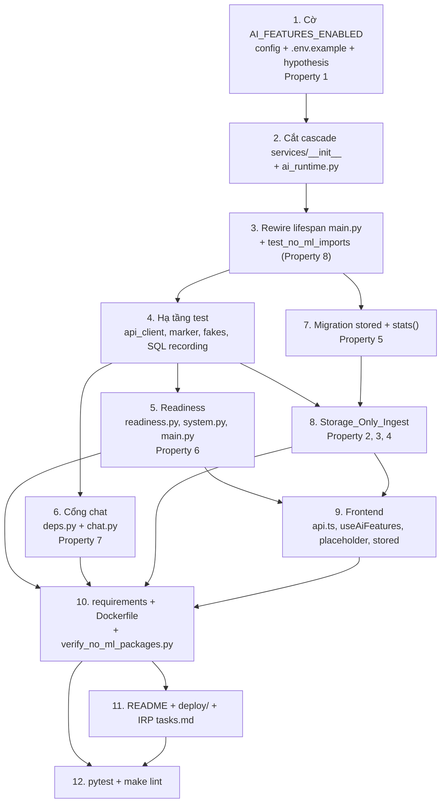

# Implementation Plan

## Overview

Kế hoạch này chỉ chứa các task mà coding agent thực thi được bằng cách viết, sửa hoặc chạy code. Hai tiêu chí của Yêu cầu 6 — tiêu chí 6 (kích thước uncompressed của `Runtime_Image` ≤ 50% baseline và ≤ 800 MiB) và tiêu chí 11 (RSS idle ≤ 512 MiB) — **không** có task thực thi tương ứng: design đã ghi rõ chúng là phép đo thủ công/CI, không kiểm chứng được bằng pytest. Hướng dẫn đo hai tiêu chí này được viết vào tài liệu dưới `deploy/` ở task 11.2, và kết quả đo được ghi lại ngoài danh sách task này (xem mục cuối tài liệu).

Thứ tự task tuân theo phụ thuộc thật của design: cờ cấu hình trước, cắt cascade import trước khi chạm image, hạ tầng test đặt sớm (task 4) vì các task 5, 6 và 8 tiêu thụ nó, migration `stored` trước khi bất kỳ code nào có thể ghi trạng thái `stored`, và packaging/Dockerfile cuối cùng khi code đã không còn cần các package ML.

## Tasks

- [ ] 1. Cờ cấu hình `AI_FEATURES_ENABLED`
  - [ ] 1.1 Thêm `hypothesis` làm test dependency được ghim
    - `backend/requirements.txt` hiện **không** có `hypothesis` (đã xác minh); các property test của design cần nó. Thêm một dòng ghim chính xác bằng `==` (ví dụ `hypothesis==6.125.3`), đặt cạnh `pytest==8.3.4` và `pytest-asyncio==0.25.3` theo quy ước hiện có của file (test dependency nằm cùng file với runtime dependency).
    - Xác minh bản `hypothesis` chọn dùng **không** kéo `numpy` (extra `hypothesis[numpy]` mới kéo), vì `scripts/verify_no_ml_packages.py` ở task 10.3 cấm `numpy` trong `Runtime_Image` mà image vẫn cài `backend/requirements.txt`.
    - _Requirements: 6.9, 8.4_
  - [ ] 1.2 Thêm `ai_features_enabled` và validator `_parse_ai_flag` vào `backend/app/core/config.py`
    - Field `ai_features_enabled: bool = Field(default=False, validation_alias="AI_FEATURES_ENABLED")` đặt ngay sau `log_level`.
    - `@field_validator("ai_features_enabled", mode="before")` xử lý: `bool` trả nguyên, `None` và chuỗi rỗng/chỉ khoảng trắng → `False`, tập `true/1/yes/on` → `True`, tập `false/0/no/off` → `False`, còn lại raise `ValueError` với thông điệp tiếng Việt nêu tên biến `AI_FEATURES_ENABLED` và tập giá trị hợp lệ.
    - Giữ nguyên `model_cache_dir()` để `app/services/embedding.py` vẫn import được khi dependency AI có mặt.
    - Ghi chú thực tế: `get_settings()` có `@lru_cache` và được gọi ở module scope của `backend/app/main.py`, nên giá trị cờ sai làm tiến trình thất bại ở **bước import**, sớm hơn lifespan. Đây là hành vi mạnh hơn câu chữ của tiêu chí 1.3; không thêm cơ chế trì hoãn validate.
    - _Requirements: 1.1, 1.2, 1.3, 1.7_
  - [ ] 1.3 Ghi biến cờ vào `backend/.env.example`
    - Thêm khối `AI_FEATURES_ENABLED=false` kèm comment nêu tập giá trị hợp lệ, giá trị mặc định, và câu lệnh cài tập dependency AI tùy chọn (`pip install -r backend/requirements-ai.txt`). File hiện chưa có biến này.
    - _Requirements: 1.9_
  - [ ] 1.4 Viết `backend/tests/test_config_flag.py` gồm cả property test Property 1
    - Test ví dụ: mặc định `False` khi biến vắng; `""` và `"   "` → `False` (pydantic mặc định coi đây là lỗi, đây là lý do chính cần validator); giá trị rác → `ValidationError` có message chứa `AI_FEATURES_ENABLED`; `get_settings.cache_clear()` trước và sau mỗi case đổi env.
    - Property test bằng `hypothesis`: `_parse_ai_flag` là total function trên `str | bool | None`, idempotent trên `bool`, và mọi input hoặc trả `True`/`False` hoặc raise `ValueError`.
    - _Requirements: 1.1, 1.2, 1.3, 1.7_
    - _Properties: Property 1_

- [ ] 2. Cắt cascade import và thêm factory tầng AI
  - [ ] 2.1 Làm rỗng `backend/app/services/__init__.py`
    - File hiện re-export eager `SmartChunker`, `DifyClient`, `EmbeddingService`, `PDFParser`, `StorageService`, nên **mọi** `from app.services.<module> import X` đều kéo `embedding` → `numpy`. Thay toàn bộ nội dung bằng docstring giải thích vì sao file phải rỗng cộng `__all__: list[str] = []`.
    - Xác minh không call site nào dùng dạng `from app.services import X` (đã xác minh: repo chỉ dùng `from app.services.<module> import X`), nên thay đổi này không phá import nào.
    - _Requirements: 1.8, 6.7, 6.8_
  - [ ] 2.2 Thêm `backend/app/services/ai_runtime.py`
    - `AIDependencyError(RuntimeError)`, dataclass `AIRuntime(dify, embedding, chunker)` (`frozen=True, slots=True`), `build_ai_runtime(settings)` và `build_retriever(pool, embedding, settings)`.
    - Import tầng AI **bên trong** hàm; bọc `ImportError` thành `AIDependencyError` với thông điệp tiếng Việt nêu `exc.name` và `pip install -r backend/requirements-ai.txt`. Dùng `TYPE_CHECKING` cho type hint để không import lúc runtime.
    - `AIDependencyError` không được bắt ở bất kỳ đâu trong lifespan: startup phải thất bại thay vì tự rơi về `AI_Disabled_Mode`.
    - _Requirements: 1.4, 1.5, 1.6, 6.8, 6.13_
  - [ ] 2.3 Viết test cho `build_ai_runtime` khi thiếu dependency
    - Test khẳng định `AIDependencyError` được raise và message chứa tên tập dependency tùy chọn (`backend/requirements-ai.txt`). Dùng `monkeypatch` trên `sys.modules`/`importlib` để mô phỏng thiếu module, không phụ thuộc môi trường thật.
    - _Requirements: 1.6, 6.8_

- [ ] 3. Rewire lifespan trong `backend/app/main.py` và khóa bất biến "đường khởi động sạch ML"
  - [ ] 3.1 Bỏ import ML ở module scope và dựng tầng AI có điều kiện
    - Xóa `SmartChunker`, `DifyClient`, `EmbeddingService`, `HybridRetriever` khỏi khối import module scope (hiện ở L16–21); giữ `PDFParser`, `InMemoryRateLimiter`, `StorageService`; thêm `from app.services.ai_runtime import build_ai_runtime, build_retriever`.
    - Trong `lifespan`: set `app.state.ai_enabled = settings.ai_features_enabled`; set tường minh `app.state.dify/embedding/chunker/retriever = None`; chỉ gọi `build_ai_runtime(settings)` và `build_retriever(...)` khi cờ bật. `build_retriever` gọi sau khi `create_pool` thành công.
    - Giữ nguyên job `fail_stale_processing(older_than_seconds=settings.ingest_timeout_seconds)`; nó chỉ chạm `status='processing'` nên không ảnh hưởng trạng thái `stored`.
    - _Requirements: 1.4, 1.5, 1.6, 6.7_
  - [ ] 3.2 Thêm đúng một dòng log INFO trạng thái cờ
    - `logger.info("AI features enabled: %s", settings.ai_features_enabled)` đặt sau mọi bước startup và trước `yield`, đúng một entry cho mỗi lần khởi động tiến trình. Không log token, key, credential, presigned URL hay nội dung PDF.
    - _Requirements: 4.6, 4.7_
  - [ ] 3.3 Viết test cho lifespan ở hai chế độ
    - Gọi trực tiếp `lifespan(app)` với `create_pool` được monkeypatch: chế độ tắt → `dify/embedding/chunker/retriever` đều `None` và `ai_enabled is False`, không gọi `build_ai_runtime`; chế độ bật với factory được monkeypatch → bốn attribute được set. Cần test riêng vì fixture `api_client` ở task 4 cố tình không chạy lifespan.
    - _Requirements: 1.4, 1.5, 4.6_
  - [ ] 3.4 Viết `backend/tests/test_no_ml_imports.py` (Property 8)
    - Chạy `subprocess` với `AI_FEATURES_ENABLED=false` thực hiện `import app.main` rồi assert `{"torch", "transformers", "sentence_transformers", "numpy"} ∩ sys.modules == ∅`. Dùng subprocess vì tiến trình pytest có thể đã import `numpy` qua đường khác.
    - Ghi chú thứ tự: design đặt test này ở bước cắt cascade, nhưng nó chỉ pass được **sau** khi 3.1 xong, vì `main.py` còn import `EmbeddingService`/`HybridRetriever` ở module scope cho tới lúc đó. Vì vậy test nằm ở cuối task 3 để suite xanh sau mỗi parent task.
    - _Requirements: 6.7_
    - _Properties: Property 8_

- [ ] 4. Hạ tầng test (đặt ở đây vì các task 5, 6 và 8 tiêu thụ nó)
  - [ ] 4.1 Mở rộng `backend/tests/conftest.py`
    - Thêm `os.environ.setdefault("AI_FEATURES_ENABLED", "false")` cùng nhóm với ba `setdefault` hiện có, **trước** mọi import `app.*` (bắt buộc vì `get_settings()` có `lru_cache`).
    - Thêm `missing_ai_dependencies()` dựa trên `importlib.util.find_spec` cho `("sentence_transformers", "torch", "transformers", "numpy")` và marker `requires_ai_dependencies = pytest.mark.skipif(...)` với lý do skip tiếng Việt dài trong khoảng 10–200 ký tự, nêu rõ cờ và tên tập dependency còn thiếu.
    - Thêm `TEST_OWNER_ID` và fixture `fake_pool` dùng chung (bọc `FakeConnection`/`FakePool` sẵn có trong `backend/tests/fakes.py`).
    - _Requirements: 8.5, 8.6, 8.10, 1.7_
  - [ ] 4.2 Mở rộng `backend/tests/fakes.py`
    - `FakeStorage` (`configured = True`, `async check_cached() -> True`, đếm `upload_pdf`/`delete`), `FakeDify` (đếm `stream_chat`), `FakeEmbedding` (đếm `encode`).
    - Bổ sung ghi lại mọi câu SQL đã thực thi trên `FakePool`/`FakeConnection` (ví dụ `executed_statements: list[str]`) cho `execute`, `fetch`, `fetchrow`, `fetchval` và đường transaction, để Property 4 kiểm tra trên chuỗi lệnh chứ không trên trạng thái kết quả.
    - Giữ nguyên `status_updates` và các fake hiện có để `test_documents_ingest.py` không phải sửa cơ chế.
    - _Requirements: 8.10_
  - [ ] 4.3 Thêm fixture `api_client` — fixture app đầu tiên của suite
    - `conftest.py` hiện chỉ có 17 dòng và **không** có fixture app hay `TestClient` nào; đây là cái đầu tiên.
    - Dùng `TestClient(app)` **ngoài** context manager (không chạy lifespan thật), nạp `app.state` bằng fake qua `monkeypatch.setattr(app.state, name, value, raising=False)` cho `ai_enabled=False`, `pool=fake_pool`, `storage=FakeStorage()`, `dify/embedding/chunker/retriever=None`, `rate_limiter=InMemoryRateLimiter(30)`.
    - `app.dependency_overrides` cho `get_pool` và `get_current_user`; **không** override `require_ai_features` (nó là đối tượng đang được kiểm chứng); `finally: app.dependency_overrides.clear()`.
    - _Requirements: 8.4, 8.10, 8.12_
  - [ ] 4.4 Áp cơ chế skip có điều kiện cho test chạm module không import được
    - `app.services.embedding` và `app.services.retriever` không import được khi thiếu `numpy` (design cố ý giữ `import numpy` ở module scope của `embedding.py`). Với **test mới** chạm hai module này, đặt `pytest.importorskip("app.services.retriever", reason=...)` ở mức module để không có lỗi thu thập.
    - Ghi chú thực tế: không test hiện có nào import `app.services.embedding`/`retriever` trực tiếp (đã xác minh). `test_app_routes.py` (import `app.main`) và `test_sse.py` (import `app.api.v1.chat`) trước đây kéo `numpy` qua cascade; sau task 2 và 3 chúng thu thập được sạch, nên không cần `importorskip`.
    - _Requirements: 8.5, 8.6_
  - [ ] 4.5 Bổ sung hai case cho `backend/tests/test_chunker.py`
    - Case không cần ML: `token_count()` fallback đếm từ theo khoảng trắng khi `transformers` vắng (`SmartChunker._get_tokenizer()` đã set `self._tokenizer = False` và thoái giảm êm).
    - Case đánh dấu `requires_ai_dependencies`: khi ML có mặt, `_tokenizer is not False` (tokenizer thật được dùng) — chốt hồi quy cho rủi ro R5 về biên chunk khác nhau trên đường bật lại.
    - _Requirements: 6.10, 8.5, 8.6, 8.13_

- [ ] 5. Readiness phản ánh chế độ
  - [ ] 5.1 Thêm `backend/app/services/readiness.py`
    - `ReadinessSnapshot` (`frozen=True, slots=True`) với sáu field boolean và property `ready`: `core = database and storage_configured and storage_reachable`; trả `core` khi `ai_enabled` false, trả `core and dify_configured and embedding_configured` khi true.
    - `async evaluate_readiness(state)` đọc `check_database(pool)`, `storage.configured`, `storage.check_cached()` khi configured, và bọc `getattr(getattr(state, "dify", None), "configured", False)` cùng tương tự cho `embedding` (hai attribute là `None` ở chế độ tắt). Trả dataclass, không trả Pydantic schema — `services/` không sở hữu hợp đồng wire.
    - _Requirements: 4.1, 4.2, 4.4, 4.9, 4.10_
    - _Properties: Property 6_
  - [ ] 5.2 Thêm `ai_enabled` vào `ReadyResponse` trong `backend/app/schemas/system.py`
    - `ai_enabled: bool = False` trên `ReadyResponse`. **Không** thêm vào `DependencyStatus` — `system.py` từng dùng `all(checks.model_dump().values())` nên mọi field boolean thêm vào `DependencyStatus` sẽ tự động gate readiness và phá tiêu chí 4.1. `HealthResponse` không đổi.
    - _Requirements: 4.3, 4.5_
  - [ ] 5.3 Rewire `backend/app/api/v1/system.py`
    - `/ready` gọi `evaluate_readiness(request.app.state)`, map sang `DependencyStatus` bằng field tường minh, trả `status`, `checks`, `ai_enabled`, và `message` tiếng Việt khi chưa ready. **Xóa** `all(checks.model_dump().values())` (L29 hiện tại).
    - `/api/v1/health` giữ nguyên hoàn toàn, không có `ai_enabled`.
    - _Requirements: 4.1, 4.2, 4.3, 4.4, 4.8, 4.9_
  - [ ] 5.4 Rewire hai probe trùng lặp trong `backend/app/main.py`
    - `root_ready` hiện tự tính `configured = storage.configured and request.app.state.dify.configured and request.app.state.embedding.configured` — sẽ `AttributeError` khi hai attribute là `None`. Thay bằng `evaluate_readiness(...)` và trả `{"status": ..., "ai_enabled": ...}`.
    - `root_health` hiện trả literal JSON; chuyển sang `JSONResponse(HealthResponse().model_dump())` để giá trị không hard-code hai chỗ, giữ đúng tập trường và giá trị (`status=ok`, `service=studyrag-api`, `version=0.1.0`).
    - Hai route ở `main.py` được giữ vì healthcheck Docker/Nginx đang trỏ tới chúng.
    - _Requirements: 4.3, 4.5, 4.9_
  - [ ] 5.5 Viết `backend/tests/test_readiness.py` gồm Property 6
    - Bảng chân lý của `ReadinessSnapshot.ready` trên toàn bộ 32 tổ hợp năm boolean ở hai chế độ; khẳng định `ready` ở chế độ tắt **độc lập** với `dify_configured`/`embedding_configured`, và `snap_on.ready → snap_off.ready`.
    - `evaluate_readiness` với `dify=None`, `embedding=None` hoàn tất không raise.
    - _Requirements: 4.1, 4.2, 4.4, 4.9_
    - _Properties: Property 6_
  - [ ] 5.6 Viết `backend/tests/test_ready_endpoint.py`
    - Dùng `api_client`: `GET /api/v1/ready` ở chế độ tắt với Dify/embedding chưa cấu hình, database và storage fake truy cập được → `status == "ready"`, `ai_enabled is False`. `GET /ready` trả cùng `status` và `ai_enabled` trong cùng trạng thái fake (chốt hồi quy cho rủi ro R3). `GET /api/v1/health` không có field `ai_enabled`.
    - _Requirements: 4.1, 4.3, 4.5, 8.9_

- [ ] 6. Cổng `ai_features_disabled` cho `Chat_Endpoint`
  - [ ] 6.1 Thêm `require_ai_features` và `AIFeaturesGate` vào `backend/app/api/deps.py`
    - Hằng `AI_DISABLED_MESSAGE` tiếng Việt dài trong khoảng 20–200 ký tự, nêu rõ tính năng hỏi đáp AI đang tạm ngưng và có thể thử lại sau.
    - `require_ai_features(request, current_user: CurrentUser)` raise `AppError(503, AI_DISABLED_MESSAGE, code="ai_features_disabled")` khi `not bool(getattr(request.app.state, "ai_enabled", False))`. Phụ thuộc `CurrentUser` để 401 luôn thắng 503.
    - `deps.py` không import `services/`; giữ nguyên tính chất đó.
    - _Requirements: 2.1, 2.2, 2.6, 2.11_
  - [ ] 6.2 Gắn cổng ở mức router trong `backend/app/api/v1/chat.py`
    - `APIRouter(prefix="/chat", tags=["chat"], dependencies=[Depends(require_ai_features)])`. Thân hàm `chat(...)` **không đổi một dòng nào** — đây là điều kiện để không có `conversation_repo.create()`, `add_message()`, `retriever.search()` hay `dify.stream_chat()` chạy ở chế độ tắt.
    - **Không** gắn cổng cho `Conversation_Endpoints`: người dùng vẫn đọc và xóa hội thoại của chính mình.
    - Giữ `from app.services.dify import DifyError` (L16): sau khi cắt cascade nó chỉ kéo `httpx`.
    - _Requirements: 2.3, 2.4, 2.5, 2.7, 2.8, 2.10_
  - [ ] 6.3 Viết `backend/tests/test_chat_disabled.py` gồm Property 7
    - Test ví dụ: 503 với `error.code == "ai_features_disabled"`; 0 row thêm vào `messages`; `FakeDify.call_count == 0`; `content-type` là JSON, không phải `text/event-stream`; không có header `X-Conversation-ID`/`X-User-Message-ID`; body sai schema vẫn 503; thiếu token → 401.
    - Property test: với mọi body hợp lệ hoặc sai schema (JSON hợp lệ về cú pháp), response là hằng 503 với đúng shape lỗi, độ dài message trong khoảng 20–200, `len(fake_pool.executed_statements) == 0`. **Không** sinh byte không phải JSON — trường hợp body không parse được thành JSON đã có tiêu chí riêng (Yêu cầu 2 tiêu chí 9) quy định trả 422, nên property test cố ý loại nó khỏi miền sinh mà không hy sinh tiêu chí 2.6.
    - _Requirements: 2.1, 2.2, 2.3, 2.4, 2.5, 2.6, 2.8, 2.10, 8.7_
    - _Properties: Property 7_
  - [ ] 6.4 Bổ sung assertion vào `backend/tests/test_app_routes.py`
    - Route `/chat` vẫn tồn tại trong `app.routes` ở chế độ tắt (cổng trả 503, không phải 404) — giữ tính tương thích route/method của NFR 3.
    - _Requirements: 2.7_

- [ ] 7. Migration `stored` và sửa `stats()` (cùng một task để không có cửa sổ `KeyError`)
  - [ ] 7.1 Thêm `supabase/migrations/002_add_stored_document_status.sql`
    - `BEGIN`/`COMMIT` tường minh; khối `DO $$` tra `pg_constraint` theo `pg_get_constraintdef(con.oid) LIKE '%ocr_required%'` để tìm CHECK constraint hiện tại thay vì tin vào tên (bản `001_init.sql` ở hai nơi viết CHECK khác định dạng: `backend/app/db/migrations/001_init.sql` một dòng, `supabase/migrations/001_init.sql` hai dòng); drop rồi `ADD CONSTRAINT documents_status_check CHECK (status IN ('processing','stored','ready','failed','ocr_required'))`.
    - Chỉ chạm ràng buộc CHECK của `documents.status`. Không chạm `document_chunks`, `conversations`, `messages`, extension `vector`/`unaccent`, `public.immutable_unaccent`, ba index `idx_chunks_doc`/`idx_chunks_tsv`/`idx_chunks_vec`, bốn policy RLS.
    - _Requirements: 7.4, 7.7, 7.9, 3.9_
  - [ ] 7.2 Tạo bản sao deploy và test khẳng định hai file giống hệt
    - `backend/app/db/migrations/002_add_stored_document_status.sql` giống hệt từng byte bản canonical. Thêm một test đọc cả hai file và assert nội dung bằng nhau (0 dòng khác biệt), để lần sửa sau không âm thầm chỉ chỉnh một bản.
    - _Requirements: 7.5_
  - [ ] 7.3 Sửa `stats()` trong `backend/app/db/repositories/document_repo.py`
    - Seed thêm `"stored": 0` vào dict kết quả, và thay `result[key] = count` bằng `result[key] = result.get(key, 0) + count` để hàm total trên mọi phân phối status. Đây là crash tiềm ẩn `KeyError` → 500 ở `GET /api/v1/documents/stats`, kéo theo `useDocuments.refresh()` (dùng `Promise.all`) làm rơi cả danh sách tài liệu ở `LibraryPage` và `DashboardPage`.
    - Giữ nguyên chữ ký `vector_search`/`lexical_search` của `ChunkRepository` và `WHERE status='processing'` của `fail_stale_processing` (`stored` là terminal, sweeper không được chạm).
    - _Requirements: 3.9, 7.8, 7.10_
    - _Properties: Property 5_
  - [ ] 7.4 Viết `backend/tests/test_document_stats.py` gồm Property 5
    - Property test với `hypothesis`: phân phối status ngẫu nhiên gồm cả `"stored"` và các chuỗi lạ (ví dụ `"archived"`) → không `KeyError`, `total` bằng tổng count, `total` bằng tổng các giá trị còn lại, năm khóa bắt buộc luôn có mặt, mọi giá trị `>= 0`.
    - _Requirements: 3.9_
    - _Properties: Property 5_

- [ ] 8. `Storage_Only_Ingest`
  - [ ] 8.1 Mở rộng `DocumentStatus` trong `backend/app/schemas/document.py`
    - `DocumentStatus = Literal["processing", "stored", "ready", "failed", "ocr_required"]`; `DocumentOut.status` và `DocumentFilters.status` tự động nhận giá trị mới. Không thêm/bớt field nào ở `DocumentOut`, `DocumentListResponse`, `IngestResponse`, `PresignedUrlResponse`.
    - _Requirements: 3.7, 3.9_
  - [ ] 8.2 Thêm nhánh early return vào `_run_ingest_pipeline` trong `backend/app/api/v1/documents.py`
    - Chèn ngay **sau** kiểm tra `parsed.requires_ocr` (để `ocr_required` thắng `stored`) và **trước** khi đọc `ChunkRepository(pool)`, `request.app.state.chunker`, `request.app.state.embedding` — dời ba dòng đó xuống dưới nhánh tắt.
    - Nhánh tắt gọi `_set_status(..., status="stored", page_count=parsed.page_count, chunk_count=0, error_message=None)` rồi `return`.
    - Truyền `chunk_count=0` tường minh ở cả nhánh `ocr_required` và `stored`.
    - Nhánh mới phải nằm **trong** `_run_ingest_pipeline`, tức bên trong `asyncio.wait_for` của `_process_document`; không tách thành task riêng ở `ingest_document`. `ingest_document` không đổi (content type, ≤50 MB, magic `%PDF-`, dedupe `(owner_id, file_hash)`, upload S3 có rollback, row `processing`, 202).
    - _Requirements: 3.2, 3.3, 3.4, 3.5, 3.6, 3.8, 3.11_
    - _Properties: Property 3, Property 4_
  - [ ] 8.3 Mở rộng whitelist bộ lọc `status` ở endpoint list document
    - Whitelist thành `{"processing", "stored", "ready", "failed", "ocr_required"}`; giá trị ngoài tập → lỗi `invalid_status` kèm thông báo tiếng Việt. Truy vấn vẫn đi qua `DocumentRepository.list(...)` với điều kiện `owner_id`.
    - _Requirements: 3.10, 3.13_
  - [ ] 8.4 Viết `backend/tests/test_documents_storage_only.py` gồm Property 3 và Property 4
    - Test ví dụ: `_process_document` với `ai_enabled=False` → `status_updates[-1].status == "stored"`, `chunk_count == 0`, 0 lệnh INSERT/UPDATE/DELETE trên `document_chunks` trong `fake_pool.executed_statements`, `FakeEmbedding.call_count == 0`, chunker không được gọi. Thêm case `requires_ocr=True` → `ocr_required`, case parser raise → `failed`.
    - Test hồi quy timeout: parser chậm cộng `ingest_timeout_seconds` rất nhỏ (ví dụ `0.05`) → `failed` kèm thông điệp timeout, khẳng định nhánh `stored` vẫn nằm trong `asyncio.wait_for`.
    - Property 3: với mọi input PDF (có text, chỉ ảnh, hỏng, 0 trang, `st.binary()`), trạng thái terminal thuộc `{stored, ocr_required, failed}`, đúng một lần chuyển terminal, `"ready"` không xuất hiện, mọi `chunk_count` bằng 0.
    - Property 4: với mọi chuỗi endpoint ở chế độ tắt, không câu SQL nào vừa chạm `document_chunks` vừa là INSERT/UPDATE/DELETE.
    - _Requirements: 3.2, 3.3, 3.4, 3.5, 3.6, 3.12, 8.8_
    - _Properties: Property 3, Property 4_
  - [ ] 8.5 Cập nhật `backend/tests/test_documents_ingest.py`
    - Thêm `ai_enabled=True` vào `_fake_request` (`SimpleNamespace` hiện có `pool`, `settings`, `pdf_parser`, `chunker`, `embedding`). Không có nó, `getattr(state, "ai_enabled", False)` trả `False` và các test này âm thầm kiểm chứng nhánh `stored` trong khi tên test nói về lập chỉ mục (rủi ro R6). Giữ assertion `status_updates[-1].status == "ready"` làm chốt phát hiện.
    - Thêm case list với `status=stored` và case `status=archived` → lỗi `invalid_status`.
    - _Requirements: 3.8, 3.10, 3.13_
  - [ ] 8.6 Viết property test owner-scope cho hai chế độ (Property 2)
    - Design phát biểu Property 2 nhưng không đặt tên file; dùng `backend/tests/test_owner_scope_property.py`. Sinh cặp `owner_id` phân biệt và tập resource ngẫu nhiên; chạy cùng bộ assertion hai lần với `app.state.ai_enabled` là `True` và `False`: response 404, không field nào của owner khác lọt vào body, snapshot row của owner khác không đổi. Thêm case thiếu/sai/hết hạn token → 401 và 0 truy vấn dữ liệu.
    - _Requirements: 8.1, 8.2, 8.3, 8.12_
    - _Properties: Property 2_

- [ ] 9. Frontend: cờ, placeholder và trạng thái `stored`
  - [ ] 9.1 Mở rộng `frontend/src/lib/api.ts`
    - `DocumentStatus` thêm `"stored"`; `DocumentStats` thêm `stored: number`; thêm `ReadyStatus { status: "ready" | "not_ready"; ai_enabled: boolean }`; thêm `getReadiness: () => request<ReadyStatus>("/ready", { signal: AbortSignal.timeout(5000) })`.
    - Đây là hàm duy nhất đọc cờ; không component hay page nào gọi `fetch` trực tiếp. Giữ nguyên `Citation`, `Message`, `Conversation`, `ChatDone`, `ChatRequest`, `streamChat`.
    - _Requirements: 3.9, 5.8, 5.11_
  - [ ] 9.2 Thêm `frontend/src/hooks/useAiFeatures.ts`
    - Promise cache ở **module scope** để mọi consumer chỉ tạo 1 request cho mỗi lần tải app. Trả `{ aiEnabled: boolean | null, unknown: boolean }`; `null` là "chưa xác định".
    - Fail-safe: lỗi mạng, response không OK, `ai_enabled` không phải boolean, hoặc quá 5 giây đều cho `aiEnabled = false` và `unknown = true`; reset cache trong nhánh `catch` để lần mount sau thử lại.
    - _Requirements: 5.8, 5.10, 5.11_
  - [ ] 9.3 Thêm `frontend/src/components/chat/ChatPlaceholder.tsx`
    - Tiêu đề tiếng Việt nêu tính năng hỏi đáp AI đang tạm ngưng; một đoạn mô tả ≤ 300 ký tự hướng người dùng sang thư viện tài liệu; **đúng một** `<Link to="/library">` với nhãn tiếng Việt, nhận focus bằng bàn phím (thêm `focus-visible:ring` theo Tailwind), điều hướng React Router không reload trang.
    - Prop `unknown?: boolean` thêm dòng "Hiện chưa xác định được trạng thái tính năng." Không render ô nhập, nút gửi hay bộ chọn tài liệu.
    - _Requirements: 5.1, 5.2, 5.4, 5.11, 5.13_
  - [ ] 9.4 Tách `ChatWorkspace` và thu gọn `ChatPage`
    - Chuyển toàn bộ nội dung `frontend/src/pages/ChatPage.tsx` hiện tại sang `frontend/src/components/chat/ChatWorkspace.tsx` (giữ `ConversationList`, `ChatPanel`, `useConversations`, `useDocuments`).
    - `ChatPage.tsx` chỉ còn switch theo cờ: `aiEnabled === null` → `Loading` (đã có `frontend/src/components/ui/Loading.tsx`), `!aiEnabled` → `ChatPlaceholder`, còn lại → `ChatWorkspace`. Phải tách ở **biên component**, không bằng `if` trong thân component, vì `useConversations()` gọi API ngay khi mount và `useDocuments()` còn `setInterval` 10 giây.
    - Route `/chat` trong `App.tsx` không đổi, không redirect. `ChatPanel`, `MessageBubble`, `CitationCard`, `ConversationList`, `useConversations` giữ nguyên, 0 file bị xóa.
    - _Requirements: 5.2, 5.3, 5.7, 5.9, 5.10, 5.15_
  - [ ] 9.5 Cập nhật `frontend/src/components/layout/Sidebar.tsx`
    - Tách mục `/chat` khỏi mảng `links`. Khi `aiEnabled === false`, render `<button type="button">` với `aria-disabled="true"`, nhãn "Hỏi đáp AI" cộng nhãn phụ "Tạm ngưng", `onClick` no-op để route không đổi. Dùng `aria-disabled` thay `disabled` để phần tử vẫn nhận focus và vẫn được screen reader đọc.
    - _Requirements: 5.5, 5.14_
  - [ ] 9.6 Cập nhật `frontend/src/pages/DashboardPage.tsx`
    - File hiện có đúng **hai** `<Link to="/chat">` (nút hero "Đặt câu hỏi" và card "Hỏi AI") và **một** `<Link to="/library">` (card "Thêm tài liệu") — khớp giả định của design. Khi `aiEnabled === false`, đổi cả hai link `/chat` thành `/library` với nhãn tiếng Việt mô tả mở thư viện (hero "Mở thư viện tài liệu", card "Xem tài liệu đã lưu"), cho kết quả 0 link `/chat` và 2 link `/library`. Khi cờ bật, giữ nguyên cấu hình hiện tại.
    - Lưu ý file được viết dồn trên một dòng rất dài; giữ nguyên style hiện có của file.
    - _Requirements: 5.6_
  - [ ] 9.7 Cập nhật ba call site của `DocumentStatus` và `DocumentStats`
    - `frontend/src/hooks/useDocuments.ts`: state khởi tạo thêm `stored: 0`.
    - `frontend/src/components/library/DocumentList.tsx`: `Record<Document["status"], ...>` là **exhaustive** nên phải thêm entry `stored: { label: "Đã lưu", tone: "neutral" }` trong **cùng task** với 9.1, nếu không `tsc` đỏ; nới điều kiện nút mở PDF từ `disabled={doc.status !== "ready"}` thành cho phép cả `stored`.
    - `frontend/src/pages/LibraryPage.tsx`: thêm `Badge` cho `stats.stored`.
    - `frontend/src/components/chat/ChatPanel.tsx`: bộ lọc `doc.status === "ready"` **giữ nguyên** có chủ đích.
    - _Requirements: 3.7, 3.9, 5.12_
  - [ ] 9.8 Chạy build frontend
    - `npm --prefix frontend run build` (`tsc -b && vite build`) phải exit 0 với 0 lỗi kiểu. Đây là cơ chế kiểm chứng chính của phần frontend vì repo không khai báo test runner cho frontend và spec này không thêm một cái.
    - _Requirements: 5.9, 5.12_

- [ ] 10. Đóng gói dependency, Dockerfile và script verify
  - [ ] 10.1 Gỡ ML khỏi `backend/requirements.txt`
    - Xóa dòng đầu `--extra-index-url https://download.pytorch.org/whl/cpu` và bốn dòng `sentence-transformers==3.4.1`, `transformers==4.48.3`, `torch==2.13.0+cpu`, `numpy==2.5.1`. Giữ 11 dòng runtime còn lại cộng `pytest`, `pytest-asyncio`, `hypothesis` (thêm ở 1.1), tất cả ghim bằng `==`.
    - _Requirements: 6.1, 6.2, 6.9_
  - [ ] 10.2 Thêm `backend/requirements-ai.txt`
    - Comment nêu cách cài (`pip install -r backend/requirements.txt -r backend/requirements-ai.txt`), rồi `--extra-index-url https://download.pytorch.org/whl/cpu` (di chuyển cùng `torch` vì chỉ wheel CPU của torch cần nó) và bốn dòng ML ghim bằng `==`.
    - _Requirements: 6.3, 6.9, 6.13_
  - [ ] 10.3 Thêm `scripts/verify_no_ml_packages.py`
    - Kiểm tra cả tên distribution đã cài (`importlib.metadata.distributions()`) và tên module import được (`importlib.util.find_spec`) cho `torch`, `transformers`, `sentence-transformers`/`sentence_transformers`, `numpy`; `sys.exit(...)` với thông điệp nêu tên package vi phạm. Kết thúc bằng `import fitz` để xác nhận PyMuPDF import được.
    - Lưu ý `make lint` đã compile `scripts` nên file mới được compile-check tự động.
    - _Requirements: 6.1, 6.2, 6.12_
  - [ ] 10.4 Dọn `backend/Dockerfile`
    - Ở runtime stage, xóa `HF_HOME=/opt/huggingface` và `SENTENCE_TRANSFORMERS_HOME=/opt/huggingface` khỏi khối `ENV` cùng comment giải thích hai biến đó; xóa `mkdir -p /opt/huggingface` và `chown -R appuser:appuser /opt/huggingface` khỏi chuỗi `RUN apt-get`; xóa `ARG EMBEDDING_MODEL=bkai-foundation-models/vietnamese-bi-encoder`, `RUN python -c "from sentence_transformers import SentenceTransformer; ..."` và `&& chown -R appuser:appuser /opt/huggingface` đi kèm (đây là phần ~500 MB weight).
    - **Giữ** `libglib2.0-0`, `libgl1`, `ca-certificates`: hai lib đầu là dependency hệ thống của PyMuPDF, không phải torch.
    - Thêm bước xác minh ở stage cuối: `COPY scripts/verify_no_ml_packages.py /tmp/...` rồi `RUN python /tmp/verify_no_ml_packages.py && rm /tmp/verify_no_ml_packages.py`. Lưu ý build context hiện là `backend/`, nên nếu giữ context đó thì phải điều chỉnh context/`COPY` cho tới được `scripts/` ở gốc repo — kiểm tra và ghi lại lệnh build đúng cho task 11.2.
    - _Requirements: 6.2, 6.4, 6.5, 6.12_
  - [ ] 10.5 Chạy lại toàn bộ suite trong môi trường không có ML
    - `python -m pytest backend/tests -q` phải exit 0, 0 lỗi thu thập, test phụ thuộc AI ở trạng thái skipped. `make test` và `make lint` phụ thuộc target `backend-install` (cài `backend/requirements.txt`), nên sau 10.1 một venv mới chính là môi trường `AI_Disabled_Mode`.
    - _Requirements: 6.7, 6.10, 8.4, 8.6_

- [ ] 11. Tài liệu và đồng bộ spec liên quan
  - [ ] 11.1 Cập nhật `README.md`
    - Thêm mục nêu bốn thông tin: tính năng AI đang tạm ngưng, tên biến `AI_FEATURES_ENABLED` với mặc định `false`, giá trị cần đặt để bật lại, và tên tập dependency AI tùy chọn `backend/requirements-ai.txt`.
    - Ghi đủ năm giá trị `Document_Status`, nêu rõ `stored` là đã lưu trữ với `chunk_count = 0` và chưa lập chỉ mục nên không tham gia truy hồi, khác `ready` là đã lập chỉ mục và tham gia truy hồi. README hiện **chưa** tài liệu hóa status nào.
    - Sửa hai chỗ đã lỗi thời: bước "Apply `supabase/migrations/001_init.sql`" cần nhắc migration `002`, và câu "`/api/v1/ready` chỉ chuyển sang `ready` khi database, S3, Dify và embedding đều được cấu hình" phải nêu rằng ở `AI_Disabled_Mode` chỉ database và storage tham gia phép tính.
    - _Requirements: 9.1, 9.2_
  - [ ] 11.2 Thêm tài liệu triển khai dưới `deploy/`
    - Thư mục `deploy/` hiện chỉ có `docker-compose.yml`, `nginx/`, `scripts/` và không có README; tạo `deploy/README.md`.
    - Nội dung bắt buộc: lệnh build `Runtime_Image` ở `AI_Disabled_Mode`, lệnh chạy container, giá trị `AI_FEATURES_ENABLED` cần đặt, và cách xác minh bằng `Readiness_Endpoint` trả `status = ready` cùng `ai_enabled = false`.
    - Viết kèm **quy trình đo** cho hai tiêu chí không codeable: (a) Yêu cầu 6 tiêu chí 6 — `docker image inspect <tag> --format '{{.Size}}'` trên baseline (image build từ `Dockerfile` trước thay đổi) và image mới, cùng kiến trúc CPU cùng base image, ghi lại cả hai số cùng ngưỡng ≤ 50% baseline và ≤ 800 MiB; (b) Yêu cầu 6 tiêu chí 11 / NFR 1 — `docker stats --no-stream` hoặc `ps -o rss=` trên tiến trình uvicorn sau 60 giây idle hậu startup, ngưỡng 512 MiB.
    - Ghi thêm hành vi đã đặc tả theo Yêu cầu 2 tiêu chí 9: body không parse được thành JSON ở `Chat_Endpoint` trả 422 chứ không phải 503. Mục này phải có trong tài liệu dưới `deploy/`, đặt cạnh phần mô tả `ai_features_disabled`, để người vận hành không báo đây là bug.
    - _Requirements: 9.6_
  - [ ] 11.3 Cập nhật `.kiro/specs/ingest-reliability-and-performance/tasks.md`
    - File hiện có đúng 17 task `IRP-001`–`IRP-017`, **tất cả** ở `pending`. Status xuất hiện ở **hai** nơi: cột `status` của bảng "DAG tổng quan" và dòng `- **Status:**` trong từng mục chi tiết — phải sửa cả hai cho mỗi task, giữ nguyên toàn bộ ID, không đánh số lại, không đổi định dạng, không xóa mục tiêu hay acceptance criteria.
    - Đặt `deferred` cho đúng sáu task `IRP-003`, `IRP-004`, `IRP-008`, `IRP-009`, `IRP-013`, `IRP-014`, mỗi task kèm một dòng lý do nêu rõ task phụ thuộc embedding hoặc chunker/tokenizer nên không còn căn cứ trong thời gian `AI_Disabled_Mode` có hiệu lực.
    - Giữ `pending` cho chín task `IRP-001`, `IRP-002`, `IRP-005`, `IRP-006`, `IRP-007`, `IRP-010`, `IRP-011`, `IRP-012`, `IRP-015`.
    - Thêm ghi chú dependency cho các task `pending` có `dependencies` trỏ tới task `deferred`: `IRP-015` (deps chứa `IRP-013`) và `IRP-016` (deps chứa `IRP-013`, `IRP-014`), nêu rõ task chỉ thực thi được sau khi `AI_Enabled_Mode` được bật lại hoặc sau khi dependency bị hoãn được loại khỏi `dependencies`.
    - Phép đếm đã chốt: sáu task `deferred`, mười một task `pending` gồm cả hai gate `IRP-016` và `IRP-017`, tổng mười bảy, theo Yêu cầu 9 tiêu chí 3, 4 và 7.
    - Thêm một dòng nêu điều kiện hoàn nguyên: khi `AI_FEATURES_ENABLED=true` và tập dependency AI tùy chọn được cài, các task `deferred` trở lại `pending` với ID, mục tiêu và acceptance criteria không đổi.
    - _Requirements: 9.3, 9.4, 9.5, 9.7, 9.8, 9.9_

- [ ] 12. Xác minh cuối
  - [ ] 12.1 Chạy `python -m pytest backend/tests -q`
    - Kỳ vọng exit code 0, 0 test thất bại, 0 lỗi thu thập, trong tối đa 300 giây, với `torch`/`sentence-transformers`/`transformers`/`numpy` **không** có trong môi trường; các test phụ thuộc AI báo skipped kèm lý do trong khoảng 10–200 ký tự. Không cần credential Supabase, S3, Dify hay endpoint embedding thật.
    - _Requirements: 6.10, 8.4, 8.5, 8.6, 8.10_
  - [ ] 12.2 Chạy `make lint`
    - Kỳ vọng exit code 0. Target hiện chạy `compileall` trên `backend/app backend/tests scripts` cộng `npm --prefix frontend run lint` (= `tsc -b --pretty false`), **không** chạy ruff — ruff không được project cài. Ghi chú: design nói `make lint` chạy `tsc --noEmit`; thực tế là `tsc -b --pretty false`, cùng tác dụng kiểm tra kiểu.
    - _Requirements: 5.12, 8.11_

## Task Dependency Graph



```json
{
  "waves": [
    { "wave": 1, "tasks": ["1"], "parallel": false },
    { "wave": 2, "tasks": ["2"], "parallel": false },
    { "wave": 3, "tasks": ["3"], "parallel": false },
    { "wave": 4, "tasks": ["4", "7"], "parallel": true },
    { "wave": 5, "tasks": ["5", "6", "8"], "parallel": true },
    { "wave": 6, "tasks": ["9"], "parallel": false },
    { "wave": 7, "tasks": ["10"], "parallel": false },
    { "wave": 8, "tasks": ["11"], "parallel": false },
    { "wave": 9, "tasks": ["12"], "parallel": false }
  ]
}
```

Ghi chú đọc đồ thị: task 4 là điều kiện tiên quyết của 5, 6 và 8 vì cả ba đều dùng fixture `api_client`, fake mới và cơ chế skip có điều kiện. Task 7 chặn task 8 để migration và bản sửa `stats()` có mặt trước khi bất kỳ code nào có thể ghi một row `stored`. Task 10 đứng sau toàn bộ thay đổi code vì chỉ khi đó mã nguồn mới không còn cần `torch`/`transformers`/`sentence-transformers`/`numpy`. Task 9 phụ thuộc task 5 (cần field `ai_enabled` trên `ReadyResponse`) và task 8 (cần giá trị `stored` trong hợp đồng API).

## Notes

**Ghi chú kiểm chứng ngoài phạm vi code**

Ba nhóm tiêu chí dưới đây **không** được kiểm chứng bằng pytest trong kế hoạch này. Đây là ghi nhận thực tế, không phải tự động hóa.

1. **Kích thước `Runtime_Image` (Yêu cầu 6 tiêu chí 6).** Đo bằng `docker image inspect <tag> --format '{{.Size}}'` trên baseline và image mới, cùng kiến trúc CPU cùng base image, so với ngưỡng ≤ 50% baseline và ≤ 800 MiB. Thực hiện thủ công một lần và ghi lại cả hai con số; có thể kèm một job CI so ngưỡng tuyệt đối 800 MiB. Bất biến gần nhất mà pytest kiểm được là `test_no_ml_imports.py` (Property 8) — nó không đo byte nhưng chặn nguyên nhân gốc là một import ML lọt vào đường khởi động.
2. **RSS idle (Yêu cầu 6 tiêu chí 11 và NFR 1).** Đo bằng `docker stats --no-stream` hoặc `ps -o rss=` trên tiến trình uvicorn sau 60 giây idle hậu startup, ngưỡng 512 MiB. Thực hiện thủ công trên VPS staging.
3. **Số lượng request của frontend (Yêu cầu 5 tiêu chí 2, 3, 8, 10).** Design ghi rõ các tiêu chí này được bảo đảm **về mặt cấu trúc** — nhánh tắt không mount component nào gọi hook API, và promise cache ở module scope của `useAiFeatures` giới hạn 1 request cho mỗi lần tải app — chứ không bằng test tự động. Repo không khai báo test runner cho frontend và spec này không thêm một cái. Cách kiểm tra là mở tab Network khi review; đưa mục này vào checklist review thay vì coi là đã tự động hóa.

Riêng Yêu cầu 6 tiêu chí 1 và 12 (không có package bị cấm trong `Runtime_Image`) **là** tự động: `scripts/verify_no_ml_packages.py` chạy trong stage cuối của Dockerfile, nên một image vi phạm không bao giờ được tạo và do đó không thể publish.
