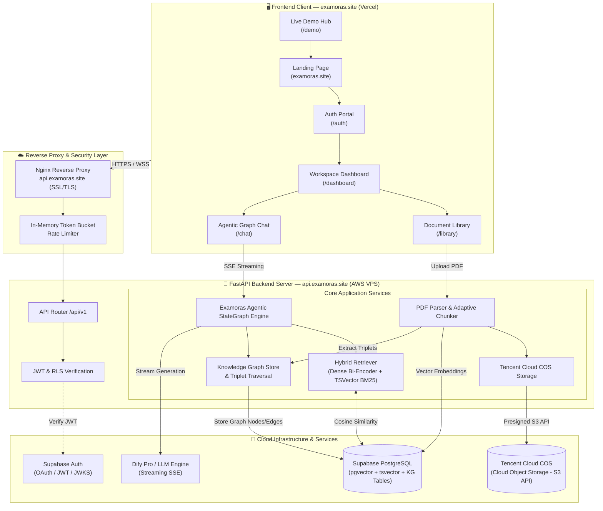
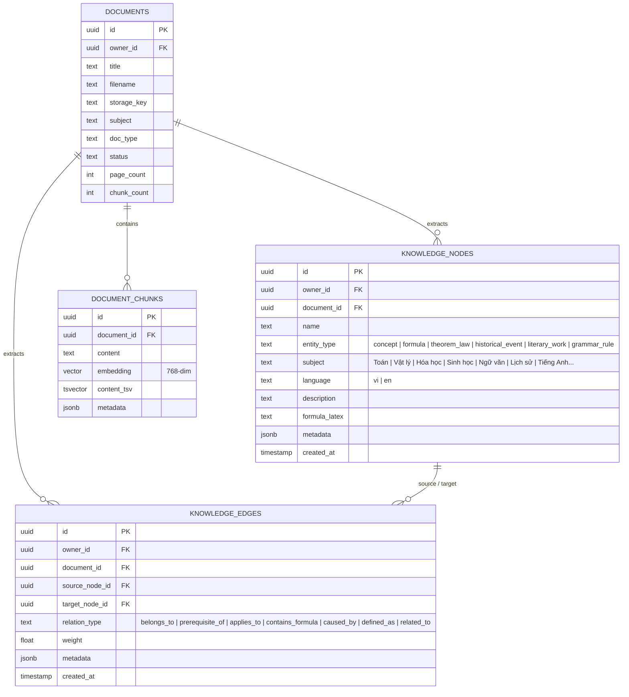
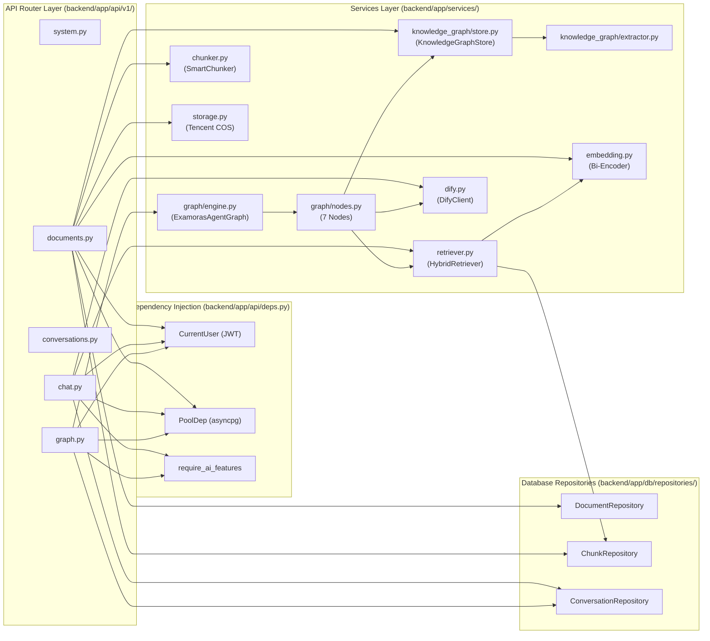
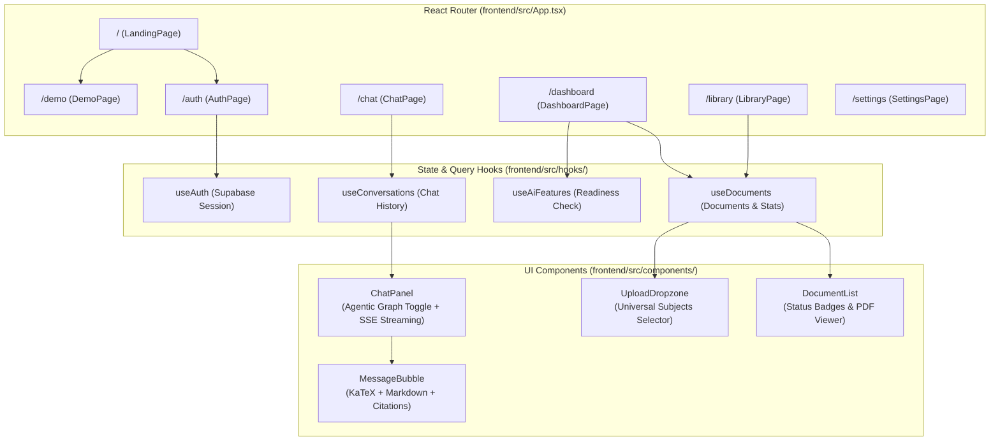

# Examoras (examoras.site) — Architecture & Code Graph Documentation

Hệ thống trợ lý học tập và ôn thi AI toàn cầu đa môn học và đa ngôn ngữ (**Examoras** — domain: `examoras.site`, API: `api.examoras.site`).

---

## 1. Overall System Architecture Graph



---

## 2. Universal Document Ingestion & Knowledge Graph Extraction Pipeline

```mermaid
flowchart TD
    A([User Uploads PDF]) --> B{Validate File}
    B -->|Size > 50MB or Not PDF| ERR1[Raise 413 / 415 Error]
    B -->|Valid PDF| C[Upload to Tencent Cloud COS]
    C --> D[PyMuPDF Text & Page Extraction]
    
    D --> E{Text Layer Present?}
    E -->|No Text Found| F[Set status: ocr_required]
    E -->|Has Text Layer| G{AI_FEATURES_ENABLED?}
    
    G -->|false| H[Set status: stored<br/>PDF preserved on COS]
    G -->|true| I[Adaptive Sliding Window Chunker<br/>500 tokens / 100 overlap]
    
    I --> J[Generate Bi-Encoder Vectors<br/>768-dim Embeddings]
    I --> K[MultiDisciplineExtractor<br/>Formulas, Theorems, Events, Rules]
    
    J --> L[Store Chunks into<br/>public.document_chunks (pgvector)]
    K --> M[Store Nodes & Edges into<br/>public.knowledge_nodes / edges]
    
    L & M --> N[Set status: ready<br/>Index complete]
    N --> O([Document Available for RAG])
```

---

## 3. Agentic RAG StateGraph Execution Flow (7 Nodes)

```mermaid
stateDiagram-v2
    [*] --> RouterNode: User Query Received

    state RouterNode {
        direction LR
        DetectLang: Detect Language (VI/EN)
        ClassifySubj: Classify Subject (Toán/Lý/Hóa/Văn/Sử/Anh...)
        ClassifyIntent: Classify Intent (Problem Solving/Formula/Essay)
        DetectLang --> ClassifySubj --> ClassifyIntent
    }

    RouterNode --> RetrieveNode

    state RetrieveNode {
        direction LR
        HybridSearch: Dense Vector + BM25 tsvector
        KGTraversal: k-Hop Graph Traversal
        HybridSearch --> KGTraversal
    }

    RetrieveNode --> GradeDocumentsNode

    state GradeDocumentsNode {
        EvalScore: Compute Relevance Score
    }

    GradeDocumentsNode --> QueryRewriteNode: Score < 65% AND Retries < Max
    QueryRewriteNode --> RetrieveNode: Expanded Terminology Query

    GradeDocumentsNode --> UniversalSolverNode: Score >= 65% OR Max Retries Exceeded

    state UniversalSolverNode {
        direction TB
        STEM: LaTeX Formulas ($..$, $$..$$) & Unit Checks
        Humanities: Argument Structuring & Chronology
        Languages: Grammar & Sentence Syntax
    }

    UniversalSolverNode --> GenerateNode: Assemble Context & Domain Prompt

    state GenerateNode {
        StreamDify: Stream Response Tokens via SSE
        AppendCitations: Ground [1], [2] Document References
    }

    GenerateNode --> HallucinationGraderNode

    state HallucinationGraderNode {
        VerifyCitations: Check Claims Grounded in Chunks
        GradeFidelity: 100% Fidelity Score
    }

    HallucinationGraderNode --> [*]: Stream Completed (event: done)
```

---

## 4. Multi-Discipline Knowledge Graph Ontology & ERD



---

## 5. Backend Dependency & Module Call Graph



---

## 6. Frontend Component & State Flow Graph



---

## 7. Storage Infrastructure (Tencent Cloud COS + AWS S3 API)

```mermaid
flowchart LR
    Client[Browser / User] -->|1. Request Upload| API[FastAPI StorageService]
    API -->|2. Stream Upload via S3 API| TencentCOS[(Tencent Cloud COS Bucket)]
    Client -->|3. Request PDF URL| API
    API -->|4. Generate Presigned URL| TencentCOS
    API -->|5. Return Presigned URL (15 mins)| Client
    Client -->|6. Direct Authenticated Stream| TencentCOS
```
