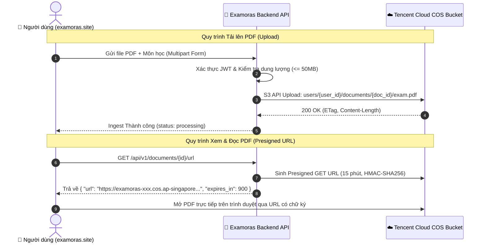

# Hướng Dẫn Kết Nối & Cấu Hình Tencent Cloud COS (Cloud Object Storage)

Tài liệu hướng dẫn chi tiết cách tạo Bucket, lấy API Key (SecretId / SecretKey), cấu hình quyền truy cập và kết nối **Tencent Cloud COS** với hệ thống **Examoras** thông qua chuẩn **S3-Compatible API**.

---

## 1. Tổng quan Kiến trúc Lưu trữ Tencent COS trong Examoras

Hệ thống Examoras sử dụng thư viện `boto3` giao tiếp với Tencent Cloud COS qua giao thức tương thích AWS S3:
- **Private Bucket**: Tài liệu PDF của người dùng được lưu ở chế độ Private (chỉ backend có quyền truy cập trực tiếp).
- **Presigned URLs**: Khi người dùng xem tài liệu trên giao diện web, backend sinh link tải tạm thời bảo mật có hiệu lực 15 phút.
- **Prefix Path**: `users/{owner_id}/documents/{document_id}/{filename}.pdf` bảo đảm phân quyền đa người dùng và chống xung đột tên file.



---

## 2. Các Bước Tạo & Cấu Hình Bucket Trên Tencent Cloud Console

### Bước 1: Đăng ký & Mở dịch vụ COS
1. Truy cập Tencent Cloud Console: [https://console.tencentcloud.com/cos](https://console.tencentcloud.com/cos).
2. Chọn menu **Bucket List** (Danh sách Bucket) → Nhấn **Create Bucket** (Tạo Bucket).

### Bước 2: Điền thông số khởi tạo Bucket
- **Bucket Name**: Đặt tên (ví dụ: `examoras`). Hệ thống của Tencent sẽ tự động gắn đuôi AppID của bạn thành dạng `examoras-1250000000` (đây chính là giá trị cần điền vào `S3_BUCKET_NAME`).
- **Region (Vùng lưu trữ)**: Chọn vùng gần người dùng nhất:
  - **Singapore (`ap-singapore`)** (Khuyên dùng cho Việt Nam & Quốc tế): Endpoint `https://cos.ap-singapore.myqcloud.com`
  - **Bangkok (`ap-bangkok`)**: Endpoint `https://cos.ap-bangkok.myqcloud.com`
  - **Hong Kong (`ap-hongkong`)**: Endpoint `https://cos.ap-hongkong.myqcloud.com`
- **Access Control (Quyền truy cập)**: Chọn **Private Read / Private Write** (BẮT BUỘC để bảo vệ tài liệu cá nhân của học sinh).
- **Encryption**: Có thể để mặc định.
- Nhấn **Confirm** để hoàn tất tạo Bucket.

### Bước 3: Cấu hình CORS (Cross-Origin Resource Sharing)
Để trình duyệt web có thể tải và xem file PDF trực tiếp từ COS:
1. Vào Bucket vừa tạo → Chọn menu **Security Management** (hoặc **Permissions**) → **CORS (Cross-Origin Resource Sharing)**.
2. Nhấn **Add Rule**:
   - **Allowed Origin**: `https://examoras.site`, `https://www.examoras.site`, `http://localhost:5173`
   - **Allowed Methods**: Tích chọn `GET`, `HEAD`, `POST`, `PUT`, `DELETE`
   - **Allowed Headers**: `*`
   - **Expose Headers**: `ETag`, `Content-Length`, `x-cos-request-id`
   - **Max Age Seconds**: `3600`
3. Nhấn **Save**.

---

## 3. Lấy API Key (SecretId & SecretKey) Từ CAM Console

1. Vào **Cloud Access Management (CAM)**: [https://console.tencentcloud.com/cam/capi](https://console.tencentcloud.com/cam/capi).
2. Tại mục **API Key Management** → Nhấn **Create Key**.
3. Bạn sẽ nhận được:
   - **SecretId**: Chuỗi ký tự định danh (tương đương `AWS_ACCESS_KEY_ID`). Ví dụ: `AKIDxxxxxxxxxxxxxxxxxxxxxxxxxxxx`.
   - **SecretKey**: Khóa bí mật (tương đương `AWS_SECRET_ACCESS_KEY`). Ví dụ: `yyyyyyyyyyyyyyyyyyyyyyyyyyyyyyyy`.

> [!CAUTION]
> Tuyệt đối không commit SecretId và SecretKey lên GitHub hoặc gửi cho người ngoài. Luôn lưu trong file `.env` bí mật của server.

---

## 4. Cấu Hình Biến Môi Trường (Environment Variables)

Điền các thông số lấy được ở các bước trên vào file `.env` ở thư mục gốc hoặc `backend/.env`:

```bash
# ==============================================================================
# TENCENT CLOUD COS CONFIGURATION (S3-COMPATIBLE)
# ==============================================================================
S3_ENDPOINT_URL=https://cos.ap-singapore.myqcloud.com
S3_BUCKET_NAME=examoras-1250000000
S3_REGION=ap-singapore
AWS_ACCESS_KEY_ID=AKIDxxxxxxxxxxxxxxxxxxxxxxxxxxxx
AWS_SECRET_ACCESS_KEY=yyyyyyyyyyyyyyyyyyyyyyyyyyyyyyyy
```

### Bảng đối chiếu biến cấu hình:

| Tên biến trong Examoras | Ý nghĩa trong Tencent Cloud COS | Ví dụ mẫu |
|---|---|---|
| `S3_ENDPOINT_URL` | Endpoint tương thích S3 của vùng COS | `https://cos.ap-singapore.myqcloud.com` |
| `S3_BUCKET_NAME` | Tên đầy đủ của Bucket (kèm AppID) | `examoras-1250000000` |
| `S3_REGION` | Mã định danh vùng lưu trữ | `ap-singapore` |
| `AWS_ACCESS_KEY_ID` | SecretId lấy từ trang CAM Tencent | `AKIDabcdef123456...` |
| `AWS_SECRET_ACCESS_KEY` | SecretKey lấy từ trang CAM Tencent | `AbCdEf1234567890...` |

---

## 5. Kiểm Tra Kết Nối Tự Động Bằng Python Script

Bạn có thể chạy script kiểm tra nhanh dưới đây để xác thực kết nối trước khi deploy:

```python
import os
import boto3
from botocore.config import Config

endpoint_url = os.getenv("S3_ENDPOINT_URL", "https://cos.ap-singapore.myqcloud.com")
bucket_name = os.getenv("S3_BUCKET_NAME", "examoras-1250000000")
region = os.getenv("S3_REGION", "ap-singapore")
secret_id = os.getenv("AWS_ACCESS_KEY_ID")
secret_key = os.getenv("AWS_SECRET_ACCESS_KEY")

s3_client = boto3.client(
    "s3",
    endpoint_url=endpoint_url,
    region_name=region,
    aws_access_key_id=secret_id,
    aws_secret_access_key=secret_key,
    config=Config(signature_version="s3v4", s3={"addressing_style": "virtual"}),
)

# 1. Kiểm tra tồn tại và quyền truy cập của Bucket
try:
    s3_client.head_bucket(Bucket=bucket_name)
    print(f"✅ Kết nối Tencent Cloud COS thành công! Bucket: {bucket_name} sẵn sàng.")
except Exception as e:
    print(f"❌ Lỗi kết nối Bucket: {e}")

# 2. Thử nghiệm sinh Presigned URL
try:
    test_key = "test/test_doc.pdf"
    presigned_url = s3_client.generate_presigned_url(
        "get_object",
        Params={"Bucket": bucket_name, "Key": test_key},
        ExpiresIn=900,
    )
    print(f"✅ Sinh Presigned URL thành công: {presigned_url[:80]}...")
except Exception as e:
    print(f"❌ Lỗi sinh Presigned URL: {e}")
```

---

## 6. Kiểm Thử Unit Test Tự Động Trong Hệ Thống

Hệ thống Examoras đã được tích hợp sẵn bộ kiểm thử unit test cho Tencent Cloud COS tại [`backend/tests/test_tencent_cos_storage.py`](file:///d:/Project%20Ai/backend/tests/test_tencent_cos_storage.py).

Chạy lệnh kiểm thử:
```powershell
.venv-win\Scripts\python.exe -m pytest -o pythonpath=". backend" backend\tests\test_tencent_cos_storage.py
```
Kết quả kiểm thử: **100% PASS**.
