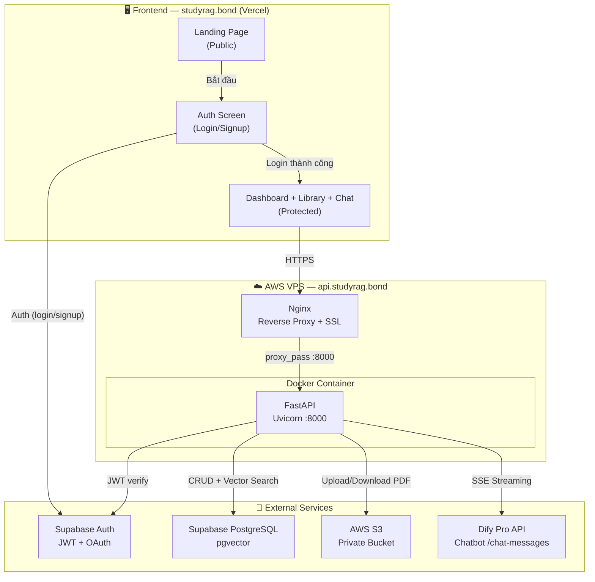
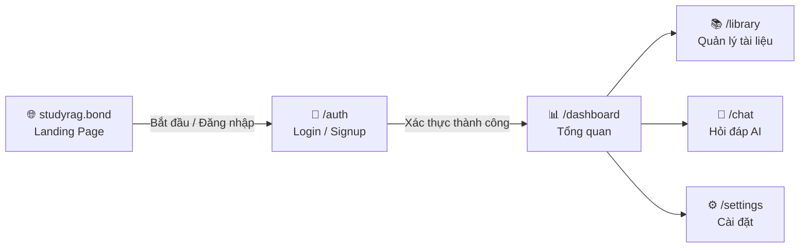
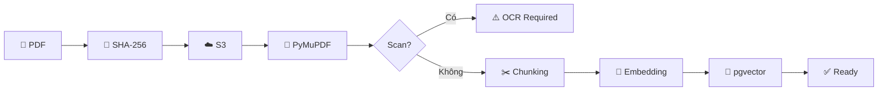
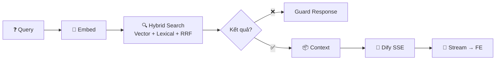

# StudyRAG V2 — Kế hoạch Xây dựng lại từ đầu

> Trợ lý AI ôn thi lớp 12 (Toán, Lý, Hóa) dựa trên tài liệu cá nhân.
> RAG Pipeline tự xây + Dify Pro làm LLM + Deploy trên AWS VPS.
> Domain: **studyrag.bond**

---

## 1. Kiến trúc hệ thống



---

## 2. User Flow



| Route | Auth | Mô tả |
|---|---|---|
| `/` | ❌ Public | **Landing Page** — giới thiệu sản phẩm, tính năng, CTA đăng ký |
| `/auth` | ❌ Public | Đăng nhập / Đăng ký / Quên mật khẩu |
| `/dashboard` | ✅ Protected | Tổng quan: thống kê tài liệu, câu hỏi nhanh, trạng thái hệ thống |
| `/library` | ✅ Protected | Upload PDF, danh sách tài liệu, filter/search |
| `/chat` | ✅ Protected | Hỏi đáp RAG (streaming), chọn tài liệu, xem citations |
| `/settings` | ✅ Protected | Đổi mật khẩu, preferences |

---

## 3. Tech Stack

| Layer | Công nghệ | Version | Lý do |
|---|---|---|---|
| **Frontend** | React + Vite + TypeScript | 18.3 / 5.4 / 5.5 | SPA nhanh, type-safe |
| **Styling** | TailwindCSS + shadcn/ui | 3.x / latest | Component đẹp, responsive, dark mode sẵn |
| **Routing** | React Router | 6.x | Client-side routing cho Landing → Auth → App |
| **Backend** | FastAPI + Uvicorn | 0.115+ / 0.30+ | Async, auto OpenAPI docs |
| **Auth** | Supabase Auth | — | Email + Google OAuth, JWT, RLS |
| **Database** | Supabase PostgreSQL + pgvector | PG 15+ / 0.7+ | Vector search + RLS + managed |
| **LLM** | Dify Pro (Chatbot API) | — | Quản lý prompt trên UI, streaming SSE |
| **PDF Storage** | AWS S3 (Private Bucket) | — | Presigned URLs, scalable |
| **PDF Parser** | PyMuPDF (fitz) | 1.24+ | Nhanh, không cần OCR server |
| **Embeddings** | sentence-transformers | 2.6+ | `bkai-foundation-models/vietnamese-bi-encoder` |
| **Deploy BE** | Docker + Nginx + Let's Encrypt | — | VPS `api.studyrag.bond` |
| **Deploy FE** | Vercel | — | `studyrag.bond`, CDN, auto preview |

---

## 4. Cấu trúc thư mục

```
studyrag/
├── backend/
│   ├── Dockerfile
│   ├── pyproject.toml
│   ├── requirements.txt
│   ├── .env.example
│   ├── app/
│   │   ├── __init__.py
│   │   ├── main.py                    # FastAPI app + CORS + lifespan
│   │   ├── core/
│   │   │   ├── config.py              # Pydantic Settings (tất cả env vars)
│   │   │   ├── auth.py                # JWT verify + get_current_user
│   │   │   └── exceptions.py          # Custom exception handlers
│   │   ├── api/
│   │   │   ├── deps.py                # Shared dependencies
│   │   │   └── v1/
│   │   │       ├── router.py          # Mount tất cả routes
│   │   │       ├── system.py          # GET /health, /ready
│   │   │       ├── documents.py       # POST /ingest, GET/DELETE /documents
│   │   │       └── chat.py            # POST /chat (RAG + Dify streaming)
│   │   ├── services/
│   │   │   ├── pdf_parser.py          # PyMuPDF text extraction
│   │   │   ├── chunker.py             # Exam/textbook chunking
│   │   │   ├── embedding.py           # Sentence-transformers wrapper
│   │   │   ├── retriever.py           # Hybrid search (vector + lexical + RRF)
│   │   │   ├── dify.py                # Dify API client (blocking + streaming)
│   │   │   └── storage.py             # S3 upload/download/presigned URL
│   │   ├── db/
│   │   │   ├── connection.py          # asyncpg connection pool
│   │   │   ├── repositories/
│   │   │   │   ├── document_repo.py   # Document CRUD
│   │   │   │   └── chunk_repo.py      # Chunk CRUD + vector search
│   │   │   └── migrations/
│   │   │       └── 001_init.sql       # Schema DDL
│   │   └── schemas/
│   │       ├── document.py            # Pydantic request/response models
│   │       ├── chat.py                # Chat request/response models
│   │       └── system.py              # Health/ready models
│   └── tests/
│       ├── conftest.py
│       ├── test_ingest.py
│       ├── test_chat.py
│       └── test_auth.py
│
├── frontend/
│   ├── package.json
│   ├── tsconfig.json
│   ├── vite.config.ts
│   ├── tailwind.config.ts
│   ├── index.html
│   └── src/
│       ├── main.tsx
│       ├── App.tsx                     # React Router setup
│       ├── lib/
│       │   ├── supabase.ts            # Supabase client
│       │   ├── api.ts                 # Backend API client + auth header
│       │   └── utils.ts
│       ├── hooks/
│       │   ├── useAuth.ts
│       │   └── useDocuments.ts
│       ├── components/
│       │   ├── ui/                    # shadcn/ui components
│       │   ├── layout/
│       │   │   ├── AppShell.tsx        # Layout cho protected pages
│       │   │   ├── Sidebar.tsx
│       │   │   └── Header.tsx
│       │   ├── landing/
│       │   │   ├── Hero.tsx            # Hero section với CTA
│       │   │   ├── Features.tsx        # 3-4 tính năng chính
│       │   │   ├── HowItWorks.tsx      # 3 bước: Upload → Hỏi → Nhận đáp án
│       │   │   └── Footer.tsx
│       │   ├── auth/
│       │   │   └── AuthScreen.tsx      # Login / Signup / Reset
│       │   ├── library/
│       │   │   ├── UploadDropzone.tsx
│       │   │   └── DocumentList.tsx
│       │   └── chat/
│       │       ├── ChatPanel.tsx
│       │       ├── MessageBubble.tsx
│       │       └── CitationCard.tsx
│       ├── pages/
│       │   ├── LandingPage.tsx         # ← Trang mở đầu (public)
│       │   ├── AuthPage.tsx            # ← Đăng nhập/Đăng ký
│       │   ├── DashboardPage.tsx       # ← Sau login, vào đây
│       │   ├── LibraryPage.tsx
│       │   ├── ChatPage.tsx
│       │   └── SettingsPage.tsx
│       └── styles/
│           └── globals.css
│
├── deploy/
│   ├── docker-compose.yml             # Production compose
│   ├── nginx/
│   │   └── studyrag.conf              # api.studyrag.bond reverse proxy
│   └── scripts/
│       └── setup-vps.sh               # One-click VPS setup script
│
├── supabase/
│   └── migrations/
│       └── 001_init.sql
│
├── scripts/
│   ├── dev.sh
│   └── evaluate.py
│
├── Makefile
├── .gitignore
├── .env.example
├── vercel.json
└── README.md
```

---

## 5. Landing Page Design

Trang giới thiệu tại `studyrag.bond` — dark theme, hiện đại, tiếng Việt.

### Sections:

**① Hero Section**
- Headline: "Trợ lý AI ôn thi Lớp 12 — từ chính tài liệu của bạn"
- Sub: "Upload đề thi, sách giáo khoa → AI đọc hiểu và giải đáp có trích dẫn trang, câu chính xác."
- CTA button: **"Bắt đầu miễn phí →"** (link tới `/auth`)
- Background: gradient night blue → indigo + floating particles

**② Features (3 cards)**
| Icon | Tính năng | Mô tả |
|---|---|---|
| 📄 | Upload tài liệu | Kéo thả PDF đề thi, sách giáo khoa. Hệ thống tự cắt đoạn thông minh. |
| 🔍 | Tìm kiếm thông minh | AI hiểu ngữ cảnh tiếng Việt, tìm đúng trang, đúng câu bạn cần. |
| ✨ | Giải đáp có trích dẫn | Mỗi câu trả lời đều kèm nguồn trích dẫn: trang nào, file nào. |

**③ How It Works (3 steps)**
1. **Upload** — Tải đề thi / sách lên thư viện cá nhân
2. **Hỏi** — Đặt câu hỏi bất kỳ về nội dung tài liệu
3. **Nhận đáp án** — AI trả lời kèm trích dẫn chính xác

**④ Footer**
- Logo StudyRAG
- Links: Về chúng tôi, Liên hệ, Chính sách bảo mật
- © 2026 StudyRAG

---

## 6. Database Schema (PostgreSQL + pgvector)

```sql
CREATE EXTENSION IF NOT EXISTS vector;

-- Bảng documents: metadata từng file PDF đã upload
CREATE TABLE public.documents (
    id              UUID PRIMARY KEY DEFAULT gen_random_uuid(),
    owner_id        UUID NOT NULL REFERENCES auth.users(id) ON DELETE CASCADE,
    storage_key     TEXT NOT NULL,
    title           TEXT NOT NULL,
    filename        TEXT NOT NULL,
    file_hash       TEXT NOT NULL,
    file_size_bytes BIGINT NOT NULL,
    subject         TEXT DEFAULT 'Chung',
    doc_type        TEXT DEFAULT 'exam',
    status          TEXT DEFAULT 'processing',
    page_count      INT DEFAULT 0,
    chunk_count     INT DEFAULT 0,
    error_message   TEXT,
    created_at      TIMESTAMPTZ DEFAULT now(),
    updated_at      TIMESTAMPTZ DEFAULT now(),
    CONSTRAINT uq_owner_file UNIQUE (owner_id, file_hash)
);

CREATE INDEX idx_docs_owner ON documents(owner_id);
CREATE INDEX idx_docs_status ON documents(owner_id, status);

-- Bảng document_chunks: text + vector embedding
CREATE TABLE public.document_chunks (
    id              TEXT PRIMARY KEY,
    document_id     UUID NOT NULL REFERENCES documents(id) ON DELETE CASCADE,
    content         TEXT NOT NULL,
    embedding       vector(768),
    metadata        JSONB DEFAULT '{}',
    created_at      TIMESTAMPTZ DEFAULT now()
);

CREATE INDEX idx_chunks_doc ON document_chunks(document_id);
CREATE INDEX idx_chunks_vec ON document_chunks
    USING ivfflat (embedding vector_cosine_ops) WITH (lists = 100);

-- RLS: mỗi user chỉ thấy data của mình
ALTER TABLE documents ENABLE ROW LEVEL SECURITY;
ALTER TABLE document_chunks ENABLE ROW LEVEL SECURITY;

CREATE POLICY "owner_documents" ON documents
    FOR ALL USING (owner_id = auth.uid()) WITH CHECK (owner_id = auth.uid());

CREATE POLICY "owner_chunks" ON document_chunks
    FOR ALL USING (EXISTS (
        SELECT 1 FROM documents
        WHERE documents.id = document_chunks.document_id
        AND documents.owner_id = auth.uid()
    ));
```

---

## 7. REST API Specification

Base URL: `https://api.studyrag.bond/api/v1`

| Method | Endpoint | Auth | Mô tả |
|---|---|---|---|
| `GET` | `/health` | ❌ | Trạng thái API |
| `GET` | `/ready` | ❌ | Kiểm tra DB, S3, Dify, Embedding |
| `POST` | `/ingest` | ✅ | Upload PDF → S3 → Chunk → Embed → pgvector |
| `GET` | `/documents` | ✅ | Danh sách tài liệu của user |
| `DELETE` | `/documents/{id}` | ✅ | Xóa tài liệu + chunks + S3 |
| `GET` | `/documents/{id}/url` | ✅ | Presigned URL xem PDF |
| `POST` | `/chat` | ✅ | **SSE Streaming** — RAG → Dify → stream |

### POST /chat — SSE Streaming
```
Request:  application/json
{
  "query": "Giải câu 5 trang 3",
  "document_id": null,
  "conversation_id": null
}

Response: text/event-stream (SSE)

event: token
data: {"content": "Theo"}

event: token
data: {"content": " đề bài"}

event: done
data: {
  "answer": "Theo đề bài câu 5...",
  "citations": [{"index": 1, "document_name": "dethi.pdf", "page": 3, "text": "...", "score": 0.92}],
  "conversation_id": "conv_xxx",
  "latency_ms": 2340
}
```

---

## 8. RAG Pipeline

### Ingest (Upload → Ready)


### Query (Question → Streaming Answer)


---

## 9. Kế Hoạch Triển Khai (6 Phases)

### Phase 0 — Scaffold ⚡ `0.5 ngày`

| # | Task |
|---|---|
| 0.1 | Backup `Project Ai` → `Project Ai_old` |
| 0.2 | Tạo thư mục mới, `git init` |
| 0.3 | Init backend: `pyproject.toml`, `Dockerfile`, FastAPI `/health` |
| 0.4 | Init frontend: Vite + React + TS + TailwindCSS + shadcn/ui + React Router |
| 0.5 | `Makefile`, `.gitignore`, `.env.example`, `vercel.json` |

### Phase 1 — Backend Core 🟦 `2 ngày`

| # | Task | File |
|---|---|---|
| 1.1 | Config (tất cả env vars) | `core/config.py` |
| 1.2 | Auth (JWT verify qua Supabase JWKS) | `core/auth.py` |
| 1.3 | Exception handlers | `core/exceptions.py` |
| 1.4 | asyncpg connection pool | `db/connection.py` |
| 1.5 | S3 client (boto3) | `services/storage.py` |
| 1.6 | Dify client (blocking + **SSE streaming**) | `services/dify.py` |
| 1.7 | Pydantic schemas | `schemas/*.py` |
| 1.8 | SQL migration | `migrations/001_init.sql` |

### Phase 2 — RAG Ingest 🟩 `2 ngày`

| # | Task | File |
|---|---|---|
| 2.1 | PyMuPDF parser + OCR detection | `services/pdf_parser.py` |
| 2.2 | Smart chunker (exam + textbook) | `services/chunker.py` |
| 2.3 | Embedding service (lazy load, batch) | `services/embedding.py` |
| 2.4 | Document repo (asyncpg CRUD) | `db/repositories/document_repo.py` |
| 2.5 | Chunk repo (save + vector) | `db/repositories/chunk_repo.py` |
| 2.6 | Ingest route: POST /ingest, GET/DELETE /documents | `api/v1/documents.py` |
| 2.7 | Tests | `tests/test_ingest.py` |

### Phase 3 — RAG Query + Chat 🟨 `2 ngày`

| # | Task | File |
|---|---|---|
| 3.1 | Hybrid retriever (vector + lexical + RRF) | `services/retriever.py` |
| 3.2 | Vector search in chunk_repo | `db/repositories/chunk_repo.py` |
| 3.3 | Chat route: POST /chat (SSE streaming) | `api/v1/chat.py` |
| 3.4 | Retrieval guard | `api/v1/chat.py` |
| 3.5 | Tests + evaluation script | `tests/`, `scripts/evaluate.py` |

### Phase 4 — Frontend 🟪 `3-4 ngày`

| # | Task | File |
|---|---|---|
| 4.1 | Supabase client + Auth hooks | `lib/supabase.ts`, `hooks/useAuth.ts` |
| 4.2 | API client + auth header + 401 handler | `lib/api.ts` |
| 4.3 | React Router setup | `App.tsx` |
| 4.4 | **Landing Page** (Hero, Features, HowItWorks, Footer) | `pages/LandingPage.tsx` |
| 4.5 | **Auth Screen** (Login/Signup/Reset) | `pages/AuthPage.tsx` |
| 4.6 | AppShell + Sidebar + Header (dark theme) | `components/layout/` |
| 4.7 | Dashboard (stats, quick search) | `pages/DashboardPage.tsx` |
| 4.8 | Library (upload, list, filter) | `pages/LibraryPage.tsx` |
| 4.9 | Chat (**SSE streaming**, markdown + KaTeX, citations) | `pages/ChatPage.tsx` |
| 4.10 | Settings | `pages/SettingsPage.tsx` |

### Phase 5 — Deploy 🟫 `1 ngày`

| # | Task | File |
|---|---|---|
| 5.1 | Dockerfile production (multi-stage) | `backend/Dockerfile` |
| 5.2 | docker-compose.yml | `deploy/docker-compose.yml` |
| 5.3 | Nginx (`api.studyrag.bond` + SSL) | `deploy/nginx/studyrag.conf` |
| 5.4 | VPS setup script | `deploy/scripts/setup-vps.sh` |
| 5.5 | Vercel deploy (`studyrag.bond`) | `vercel.json` |
| 5.6 | DNS: `studyrag.bond` → Vercel, `api.studyrag.bond` → EC2 | — |

---

## 10. Deploy Architecture

```
studyrag.bond (Vercel CDN)
    → Landing Page (public)
    → Auth Screen
    → Dashboard / Library / Chat (protected)
    → Gọi API tới api.studyrag.bond

api.studyrag.bond (AWS EC2)
    → Nginx (SSL Let's Encrypt)
    → Docker: FastAPI :8000
    → Connects to: Supabase DB, S3, Dify
```

---

## 11. Environment Variables

| Variable | Nơi | Mô tả |
|---|---|---|
| `APP_ENV` | Backend | `development` / `production` |
| `FRONTEND_ORIGINS` | Backend | `https://studyrag.bond` |
| `DATABASE_URL` | Backend | Supabase PostgreSQL DSN |
| `SUPABASE_URL` | Both | `https://<ref>.supabase.co` |
| `SUPABASE_ANON_KEY` | Frontend | Public key (Auth client-side) |
| `SUPABASE_SERVICE_ROLE_KEY` | Backend | Secret key (Admin API) |
| `SUPABASE_JWT_ISSUER` | Backend | `https://<ref>.supabase.co/auth/v1` |
| `DIFY_API_BASE_URL` | Backend | `https://api.dify.ai/v1` |
| `DIFY_API_KEY` | Backend | Dify Chatbot app API key |
| `S3_BUCKET_NAME` | Backend | S3 bucket name |
| `S3_REGION` | Backend | `ap-southeast-1` |
| `AWS_ACCESS_KEY_ID` | Backend | IAM key |
| `AWS_SECRET_ACCESS_KEY` | Backend | IAM secret |
| `EMBEDDING_MODEL` | Backend | `bkai-foundation-models/vietnamese-bi-encoder` |
| `VITE_SUPABASE_URL` | Frontend | Supabase URL |
| `VITE_SUPABASE_ANON_KEY` | Frontend | Supabase anon key |
| `VITE_API_BASE_URL` | Frontend | `https://api.studyrag.bond/api/v1` |

---

## Tóm tắt

| Phase | Tên | Thời gian |
|---|---|---|
| 0 | Scaffold | 0.5 ngày |
| 1 | Backend Core | 2 ngày |
| 2 | RAG Ingest | 2 ngày |
| 3 | RAG Query + Chat | 2 ngày |
| 4 | Frontend (Landing + Auth + App) | 3-4 ngày |
| 5 | Deploy (VPS + Vercel) | 1 ngày |
| | **Tổng** | **~10-12 ngày** |

> [!IMPORTANT]
> **Thứ tự**: Backend trước (Phase 0-3) → Frontend sau (Phase 4) → Deploy cuối (Phase 5).
> Mỗi Phase hoàn thành sẽ test verify trước khi sang Phase tiếp.
